# Yet Another Limbus Company Tier List

Written by a stats-obsessed psychopath. Maintained by LOWERCASE#0357.  
Critically reviewed by Nex#7448 and Kervina.

---

## Introduction

**What this is:**  

An encounter agnostic tier list. The rationale behind a sinner's rank will never be based solely on their performance in existing content. First and foremost, the numbers on their rolls will be analyzed in detail to approximate their ability to clash and deal damage, since this ability is universal and critical. Then, notable parts about their kit that compensate or undermine their numbers will be taken into account. Example strategies and experiences will be provided if appropriate, but won't form the basis of judgement.

What this means is, this list will make the Limbus Company experience and future stages as accessible as possible. Investing in high-tier units will provide a practical way to clear content. Failing that, it will illustrate the opportunity cost of not having certain units (which is usually more acceptable than intuition would suggest).

If one wishes to attempt to future-proof their unit choices, this is not a bad place to start. Regardless, please recognize that all tier lists, including this one, are generalizations.

**What this isn't:**
- A mirror dungeon tier list. Animation speeds and performance in undertuned stages with arbitrary artifacts play absolutely no role in any of these rankings.
- A story tier list. [Virtually any strategy](https://www.youtube.com/playlist?list=PL9PkdtklMNOv6vDgTHwNvtsLecK0G7GrR) can work for story stages. This means that they generally cannot provide meaningful feedback on a sinner's future viability.
- An autobattle tier list. Knowing how to redirect clashes, cancel enemy actions, pace skill pools and manipulate skill order within a turn is critical for maximizing certain identities.

---

## Rankings

Ordering within tiers is not as important as the tiers themselves.

A cyan badge indicates that a unit benefits significantly from technical prowess. They may have requirements to unlock their damage, require specific techniques to compensate for a lack of damage, emphasize tempo control, or gain more than usual from having multiple actions per turn. (W Don, R Heathcliff, G Gregor, R Ishmael, Sevens Outis, Sevens Yi Sang)

A yellow badge indicates that a unit has a notably good support passive. They may be impactful when benched, especially for low-sinner teams. Note that the ranking evaluates fielded performance, not support passives, so this badge merely serves as a footnote on how an identity may stay relevant despite their rank. (TT Hong Lu, G Gregor, Sevens Outis, Blade Outis, Liu Hong Lu, LCB Rodion, Mariachi Sinclair)

A pink badge indicates that a unit performs abnormally well in the context of maximin strategies. They may be an option for optimizing Refraction Railway, but require too many resets or too much setup to be practical in other settings. (Shi Ishmael, LCCB Ishmael)

---

**S TIER — META**

Units in this tier tend to directly outperform or invalidate units in lower tiers. Typing aside, if they can't make a clear work, it's unlikely replacing them will help. At some points, using them almost feels like cheating.

---

**A TIER — RELIABLE**

These units win clashes that units in lower tiers couldn't, and can be relied upon to hold their own and pull their weight. They feel solid to pilot and their kits are easily appreciated.

---

**B TIER — MEDIOCRE**

Neither great nor terrible, these units may leave a player idly wishing they were someone else. That being said, they aren't liabilities.  
No individual writeups are available for this tier yet, [but everyone's roll charts can be found here.](https://github.com/null-machine/limbus-company-roll-analyzer/tree/main/charts)

---

**C TIER — TECHNICAL**

One must go out of their way to get these sinners to outperform other options. Whatever specialties they have are likely to be easily made redundant, and their rolls are subpar.  
No individual writeups are available for this tier yet, [but everyone's roll charts can be found here.](https://github.com/null-machine/limbus-company-roll-analyzer/tree/main/charts)

---

**D TIER — CHALLENGE**

These units should not be prioritized for practical combat.  
No individual writeups are available for this tier yet, [but everyone's roll charts can be found here.](https://github.com/null-machine/limbus-company-roll-analyzer/tree/main/charts)

---

## Rationale

[A full explanation of how to read the roll charts can be found here.](https://github.com/null-machine/limbus-company-clash-tool) 

For a condensed version, the cyan yellow and magenta lines represent a sinner's chance to beat a power at max, zero and minimum sanity. The y-axis represents chance of winning the clash, and the x-axis represents the power of the opposing skill.

"agg" → aggregate, or clash power.  
"raw" → raw damage.  
"var" → variance, or heads dependency.

Emphasis will not be placed on colours— there's no telling what future EGOs hold in store. Furthermore, Refraction Railway 1 has proven that simply taking strong individual identities will outperform a team that goes out of its way to align colours for EGO or resonance. Having rare damage types in the current state of the game will not serve as as a ranking factor for similar reasons.

For the sake of transparency, let it be known that the author uses G Gregor, KK Hong Lu, L Faust and W Don very frequently, and dislikes R Heath, N Rodion and LCCB Ishmael. Everything is still kept as objective as possible.

---

### S Tier: Don Quixote - W Corp. Cleanup Agent

The weak chart represents Don Quixote with Rip Space uncharged.

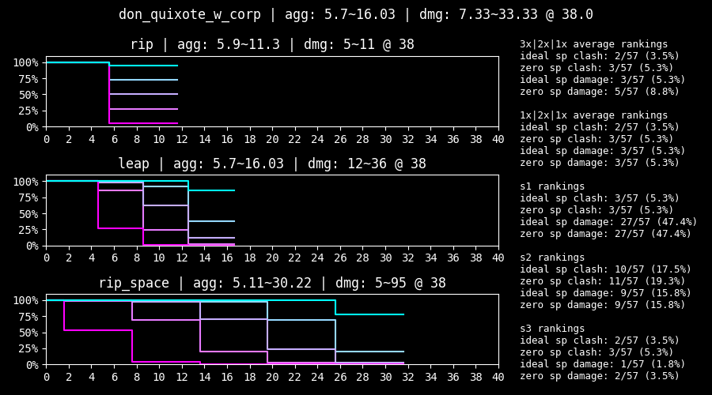

W Don rewards technical play more than any other identity. At the surface level, playing around S3 tempo allows her to set the standard for what high DPS should look like. Being a charge unit with an evade also lends well to high performance solo or low-sinner clears. S2 additionally inflicts fragile, rewarding tempo control even further. Within individual turns in low-sinner clears, players capable of manipulating skill order will be given agency to charge and fire S3 in the correct order, resulting in good fragile usage, less dead turns and more frequent S3 usage. She has a well-known synergy with Telepole and a lesser known synergy with W Faust's support passive, but relies on neither to earn her rank at the top of the charts. Of course, her S2 and S3 are great at clashing, as befitting an S tier unit.

That being said, she has a few downsides. Her S1 is miserable and can result in dead turns. Her performance may degrade significantly or have increased reliance on Telepole when only given one action a turn. A notable example of this is when she is forced to play S1 multiple turns in a row— something that can be avoided when given multiple actions. Of course, autobattle plays her pretty poorly, but a reason that trivial will not be factored into her ranking. Other guides may point out that S3's damage is excessive for general content, but having too much damage seems like a good problem to have... and her S2 remains reliable anyways.

*When the space is ripped (clear by Nex#7448)*

---

### S Tier: Heathcliff - R Corp. 4th Pack Rabbit

The weak chart represents Heathcliff with less than 6 speed.

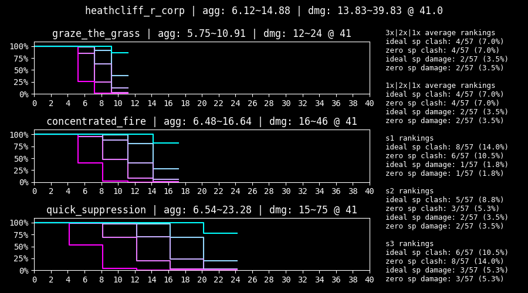
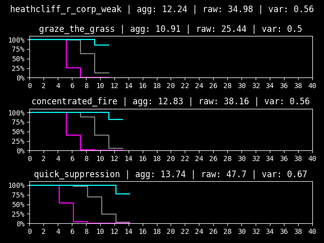

A Quick Suppression at 6+ speed can perform a similar role to a charged Rip Space. Additionally, tech exists to conserve ammo, such as using Bodysack to cycle S1 and S2. Even when out of ammo, his clashing power remains, so he can still reliably neutralize incoming threats with his insane roll numbers. His kit effects also add considerably more damage than is standard, with 4 fragile on S3. Although he has an evade, soloing is probably not advisable due to his ammo mechanics. On the flip side, this means he won't experience a loss in performance in a full team of sinners.

---

### S Tier: Ryoshu - R.B. Chef de Cuisine

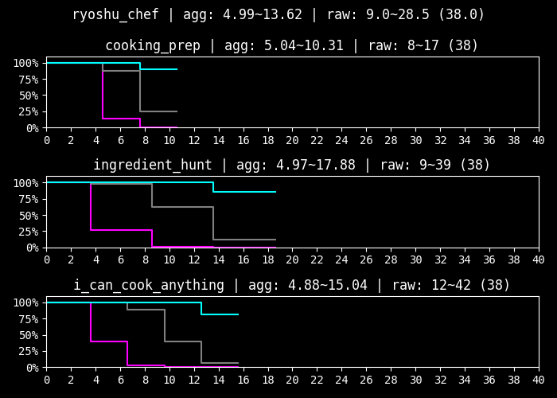

Unlike W Don and R Heath, Chef Ryoshu has no limitations on when she can fire her skills. Her S2 is excellent at clashing, and her S3 has remarkably high damage (but not to the same degree as RS and QS). As of Hell's Chicken, there is a possible bug that causes S3 to experience reversed scaling with enemy defense, so it is unknown how it will behave in the future. Regardless, she can be thought of as a consistently strong fighter, as opposed to the highs and lows of W Don and R Heathcliff. Her numbers are definitely there, and she can be expected to clash and deal damage very reliably. Having an evade and no ammo limitations opens up low-sinner strategies as well. The haste on evade win is certainly not unwelcome.

Her kit itself is a bit strange; anti-heal and heal on kill are both rather stage dependent. But, with numbers like that, being a bit dilapidated doesn't define her performance.

It's worth mentioning that her 4th Match Flame passive can theoretically buff her S3, adding tempo to her kit and bringing the raw value up to 50.17 → 68.25, but playing around that is an undertaking most players will not find practical. Maybe it'll show up as a deranged RR tactic...

---

### S Tier: Hong Lu - Tingtang Gangleader

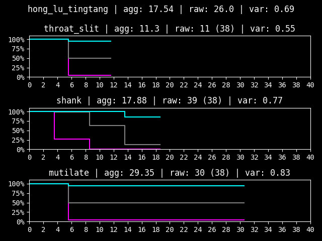

The sanity update was so good to TT Hong Lu that the roll analyzer now says he's the strongest clasher in the game. Mutilate used to be a dicey shitpost, but it now rolls 30+ with a 95% chance, giving it the highest aggregate in the game (excepting Rip Space, which has charge limitations). His Shank also has the highest aggregate among all S2s, edging out even Ingredient Hunt and Concentrated Fire (but, it's not like either of those would have been likely to lose a clash either). Furthermore, he has no charge or ammo limitations, giving him free reign to abuse that 95% heads to activate all his skill effects and perform extremely well. Ironically, the fact that Mutilate high rolls so high makes him arguably pretty consistent. For other sinners, if their skills don't have enough aggregate, they'll ultimately still rely on the enemy to low roll. Mutilate will not have that problem. In a case where S3 rolling heads won't win a clash, chances are nothing short of high-end egos will outperform it. He gets obligatory bonus points for having an evade, and a relatively strong one at that. It's also worth noting that he has 35 defense, which is considerably higher than other identities with good rolls.

He does have a few downsides though. Besides the miserable S1, he does not tolerate low sanity as well as other sinners. Notably, his combat passive provides a smidge of sanity, which, although undertuned, certainly isn't unwelcome in his heads oriented kit. Additionally, although his kit is cohesive, his damage is not as high as the other units with heavy multicoin skills. Ironically, this makes his overall contributions relatively defensive.

---

### S Tier: Hong Lu - Kurokumo Wakashu

Due to technical limitations, use the normal chart for evaluating aggregate and the prime chart for evaluating raw damage.

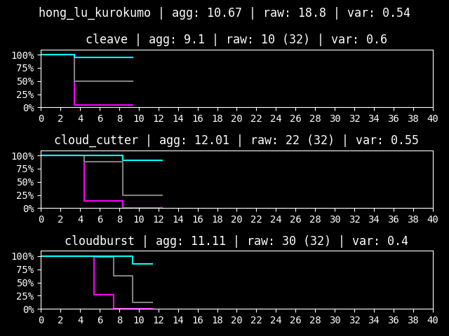
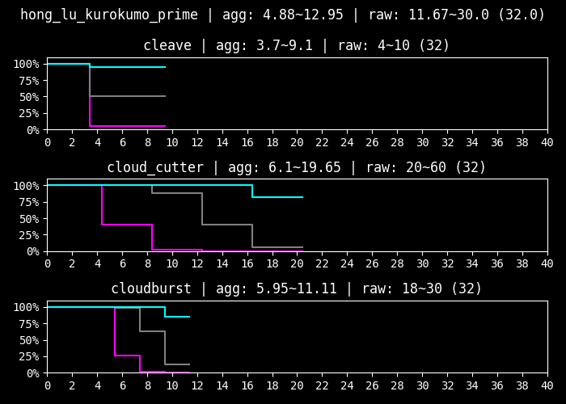

Cloud cutter.

---

### S Tier: Faust - The One Who Grips

The prime chart represents Faust with Representation Emitter's +2 power active.

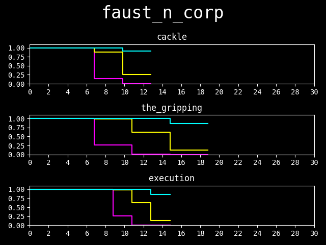
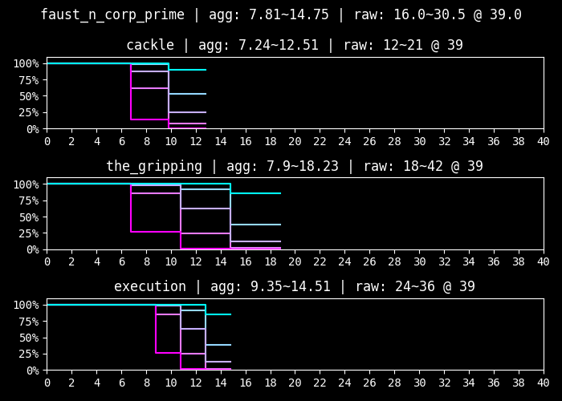

N Faust is almost a twin to Chef Ryoshu— S2 oriented, lots of multicoins, no ammo or charge limitations, a techy evade and solid clashes. She'll fare consistently and reliably with her great numbers. Additionally, her kit is more organized than Chef Ryoshu's. The gaze next turn on S2 adds easily capitalized tempo to her kit, and SP restoration is never unappreciated.

Despite the similarities, Chef Ryoshu has better rolls, and will generally contribute more total damage compared to what N Faust would add with her gaze and nails. That being said, their general differences are not as significant as those that would be imposed by type weaknesses, so there's room for them both in S tier.

---

### A Tier: Gregor - G Corp. Manager Corporal

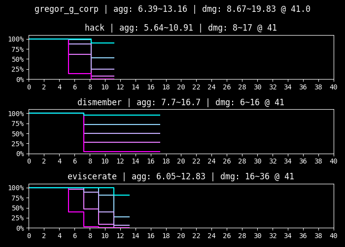

Contrary to intuition, G Gregor's clashes are virtually identical to Sevens Outis! This is plainly evident when comparing their roll charts and aggregates. The reason for this is, G Gregor has an entire 9 offense level over her, and a difference of 5 levels translates to 1 power in a clash. So even though Sevens Outis has an additional +2 power in every clash due to her skill effects, G Gregor just does that by default. So, in practice, if one of them can win a clash, it's very likely the other can as well. The purpose of this analogy is to emphasize that G Gregor is excellent at clashing. If he fails to win, which is relatively uncommon, his kit provides so much healing that he will generally be able to shrug off lost clashes with little to no consequence. This utility makes him better at pulling dangerous skills away from core DPS units than most other tanks, especially considering how they tend to be too slow to pull clashes. Furthermore, deliberately allowing him to get staggered and healing him up during low pressure effectively makes him immortal in later rounds, since he'll effectively have removed his own stagger thresholds. Piloting him feels like giving the team a regenerating frontal shield, enabling heavy damage payloads (e.g. Cloud Cutter) to land without risking a clash. Of course, he also enables Legerdemain spam, but, everyone knew that already. His numbers are great, he suffers no consequences, and he gives the team a huge amount of agency.

If a weakness had to be chosen, it would be his damage. However, his raw damage is still higher than almost all of the units in lower tiers.

---

### A Tier: Ishmael - R Corp. 4th Pack Reindeer

The prime chart can be used to evaluate Ishmael's clashes while Snagharpoon is active. Note that the normal chart should still be used to evaluate damage.

Praise and notes about W Don generally apply to R Ishmael as well, since she is also a charge unit with an evade and hard-hitting S3. However, her kit is more well-rounded, with a weaker S2 and S3 but a stronger S1. Notably, she can play an uncharged Mind Whip without consequence when soloing, albeit without being able to clash or choose a target. Additionally, although her combat passive drains her sanity for attack power, the loss can be easily offset through LCB Yi Sang's support passive or winning clashes repeatedly with her excellent rolls. Although this makes her reliant on sanity and Snagharpoon, she fuels the latter very well.

However, her numbers are held back by her somewhat miserable 32 offense level. Sinking also generally translates to less damage than fragile, even against abnormalities. Additionally, she either needs charge support via W Don or W Faust or to be in a low-sinner team for max potential, since her base charge generation is somewhat lacking. She is also heavily reliant on landing heads coins in order for S1 to generate charge and S2 to win clashes, which makes her early turns likely worse than average, especially with a turn one S3 draw.

---

### A Tier: Ryoshu - Seven Section 6

The prime chart represents Ryoshu with Upper Slash's effect and next turn +1 attack power active.

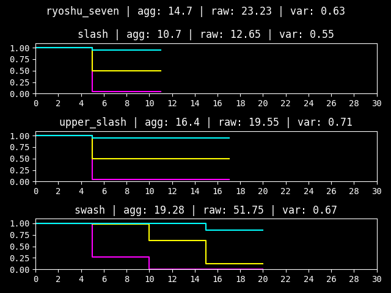
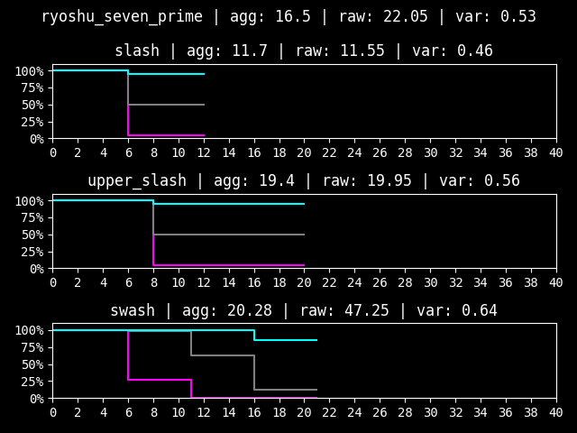

Sevens Ryoshu heralds the low rarity clash god trio with L Faust and Shi Don. Her raw damage is more concentrated in S3 and lower overall than either of them. But, she successfully compensates for that with kit effects powerful enough to make her the best slash support in the game, which get even more powerful in low-sinner teams. Besides that, her skill effects also press the advantage of her frequent clash wins by giving her even more power and damage.

Aside from the seemingly obligatory miserable S1, she also lacks an evade, reducing her viability in low-sinner teams. 

---

### A Tier: Faust - Lobotomy Corp. Remnant

The prime chart represents Faust with Representation Emitter's +2 power active, and the weak chart excludes Opportunistic Slash's +3 coin power.

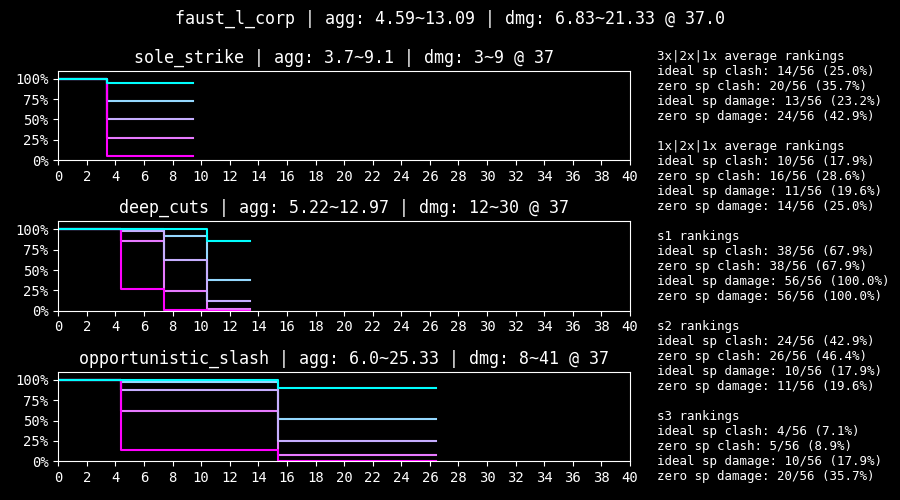
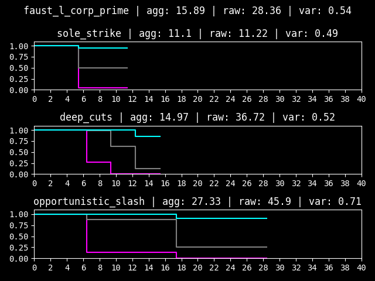
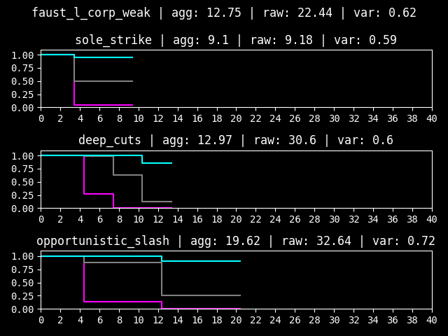

High-end rolls translate to insane clashes and acceptable damage. The haste from S2 also gives her great pulling power, allowing her to force threatening skills to clash with her reliable S2 or pseudo-ego S3. This synergy makes her an extremely competent fighter. Having an evade doesn't hurt either. She actually has better clashes than N Faust and G Gregor, but not quite as much damage or agency.

Besides the standard miserable S1, her stagger thresholds are also remarkably high. This should not be a problem in most cases, especially in teams that are capable of healing her back up past the threshold, but it does make her feel somewhat glassy. The effects in her kit are generally kind of dysfunctional as well, but to use that as an argument against her would be doing her performance disservice.

---

### A Tier: Don Quixote - Shi Section 5 Director

The prime chart represents Don with Overbreathe's effect active. The activation condition is extremely restrictive, so it is added for the sake of completeness. The ranking and statements are based solely on the normal chart.

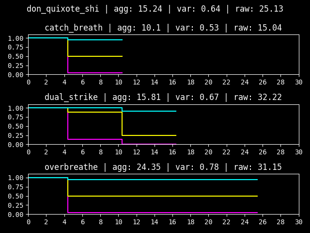
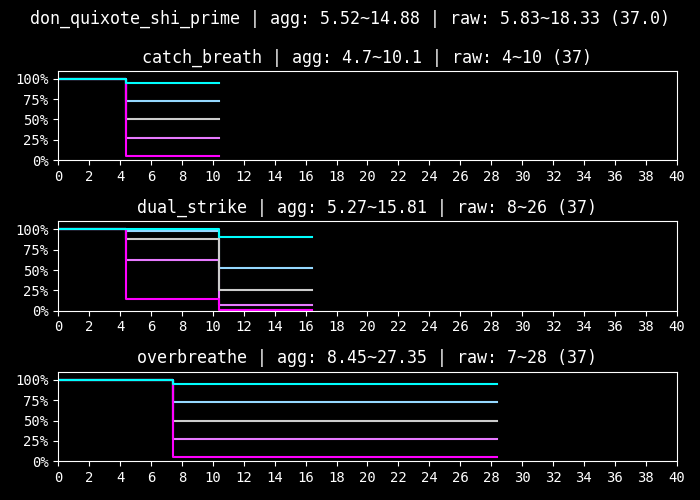

Shi Don plays similarly to L Faust, where both have insanely high clash power but not enough damage to edge them into S tier. Shi Don exaggerates this behaviour, with even better clashes and worse damage. They both even have haste on S2 and an evade, causing them to behave extremely similarly. Shi Don's passive has a much less restrictive condition though, so obtaining haste from there is far more viable than L Faust's poise count requirement. Notably, she only has two stagger thresholds, making her more forgiving than her kit would suggest.

Terrible S1 aside, she also has worse damage than L Faust, and being marginally better at clashing doesn't quite compensate for that.

---

### A Tier: Outis - Seven Section 6 Director

Due to technical limitations, the normal chart should be used to evaluate clashes, and the weak chart should be used to evaluate damage.

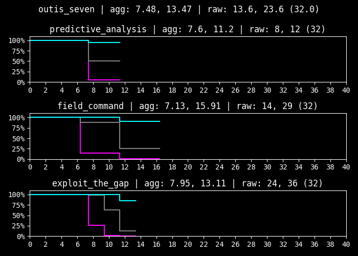
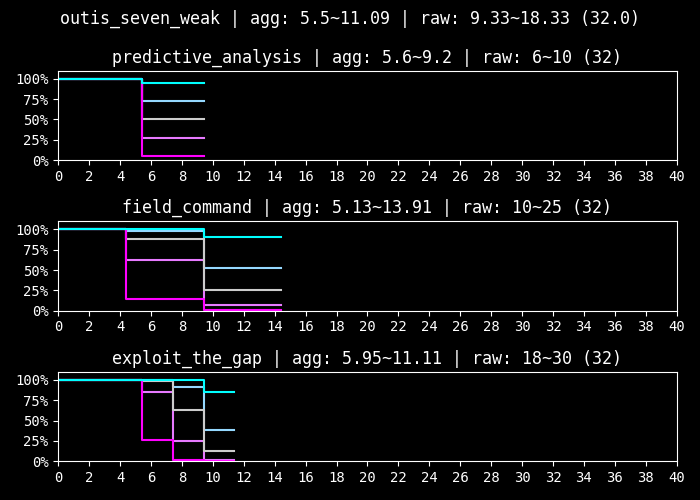

And so an interesting truth comes to light— Sevens Outis is generally worse at clashing than the low rarity clash god trio, and ties with G Gregor in terms of clash strength! But, she applies far more debuffs than the typical identity. Her presence in a team generally makes winning clashes for others easier, with the next turn paralysis on S1 and offense level down on S3. Having a high speed roll of 5-8, a high defense level of 41 and only one stagger threshold also allows her to take a similar role to G Gregor in pulling clashes and tanking the ones she loses.

However, the damage attributed to her defense level down and weakness analyzed debuffs is generally not enough to compensate for her poor numbers, and having lots of effective health is generally not preferable to G Gregor's regen.

---

### A Tier: Ryoshu - Kurokumo Wakashu

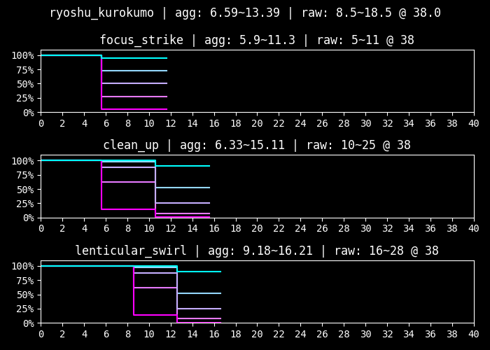

Above average rolls mean above average clashes and above average damage. Notably, she inflicts a healthy amount of bleed count, making the status effect far more impactful. But, having above average damage from statuses won't let her reach the damage contributed by S tier units anytime soon, and doubling down on more bleed just means invoking a greater opportunity cost.

Additionally, bleed is one of the more awkward damage oriented status effects, since it relies on the target to attack. Stacking a lot of bleed on a broken part or a staggered enemy that's about to die can feel mildly miserable. Also, KK Ryoshu has arguably has a bit of anti-synergy with KK Hong Lu, since it's dubious whether the extra bleed potency would kill the target faster than simply letting Cloud Cutter perform two extra hits. The other parts of her kit apply on the same turn and are relatively unimpactful. That being said, her numbers are still more than workable.

---

### B Tier: Outis - LCB Sinner

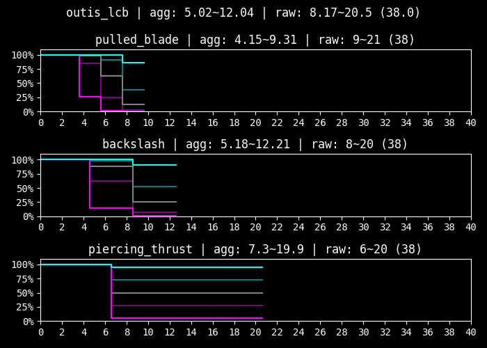

Great damage and good clashes make for a surprisingly workable identity. LCB Outis is one of the few identities with a workable S1, giving her a somewhat unique tempo. The multicoins make it pretty impactful when it connects, and serves to raise her average damage considerably, especially when used to clean up staggered targets. Her kit effects also contribute a lot more damage than is standard, which is great, considering how her numbers weren't bad to begin with. Her evade is remarkably weak, but still an evade nonetheless.

In terms of downsides, having only 26 defense makes her somewhat glassy, and she may be directly outperformed by higher tier damage-oriented identities. Still, if a roster lacks those units, or favours a different tempo, LCB Outis may be a surprisingly decent replacement. 

---

### B Tier: Hong Lu - LCB Sinner

The weak chart represents Hong Lu without the additional coin power on S2 and S3.

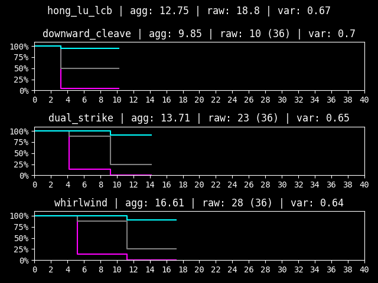
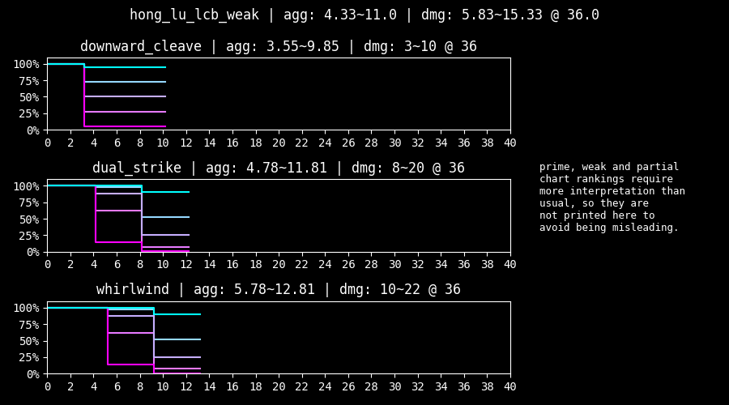

Compared to LCB Outis, LCB Hong Lu has worse damage but marginally more reliable overall clashes. S2 and S3 behave similarly and give him a powerful baseline performance. Having a (somewhat weak) evade and an easy to proc SP passive certainly aren't unwelcome either.

His kit effects contribute less damage than is standard, but the numbers make him perfectly playable nonetheless. The attack power down on S3 also applies on the same turn, making it somewhat limited. Of course, there's the miserable S1 again.

---

<!-- ### C Tier: Heathcliff - Shi Section 5

The prime chart represents Heathcliff under 25% HP and with Bodysack active.

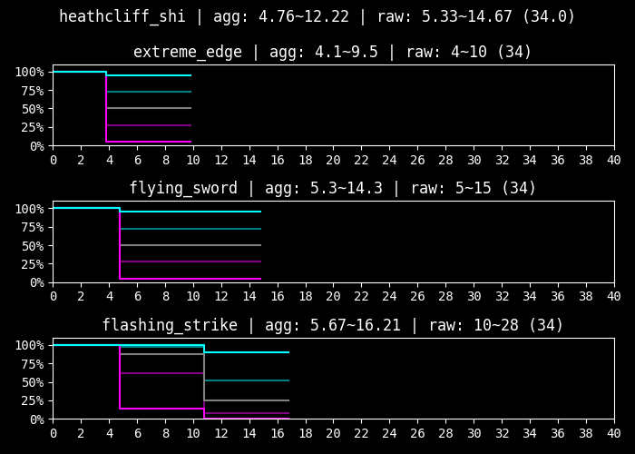
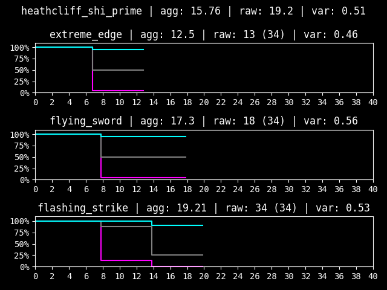

His clashes are actually pretty great. He might be viable if he's played like a normal fighter and is given a source of healing to keep him topped off from the S3 self-damage. But, after consulting someone who has an UT3 Shi Heathcliff, there are probably safer investments than this...

 -->
More individual writeups may be added later.

---

## Additional Notes

The placement of KK Hong Lu in S tier was heavily contested by Nex and heavily defended by the other two. Whether his unique S2 is capable of compensating for his glaring lack of clash power is something individual players are encouraged to decide for themselves.

Blade Outis only deserves the yellow badge if her support passive works when attacking broken abnormality parts. This still requires testing.

Whether G Gregor and Chef Ryoshu should receive a yellow badge was discussed. A slight preference was given to G Gregor, but it was decided that neither of them should receive one for fairness. Their healing is unlikely to make or break a clear, but both are definitely situationally impactful.

One thing to keep in mind is that stronger units do not necessarily correlate with more enjoyment. Weaker sinners tend to compensate their lack of power in their own strange ways, and giving them a chance tends to lead to making some funny memories. Additionally, the game in its current state is easy enough to comfortably clear with just a support unit, so there's no need to worry about accessibility yet. At the end of the day, Limbus Company is still a game, so have some fun with it!

Limbus Company belongs to Project Moon.