<meta property="og:title" content="Yet Another Limbus Company Tier List">
<meta property="og:description" content="A Limbus Company tier list based on numerical analysis, supplemented with veteran experience.">
<link rel="shortcut icon" type="image/png" href="./assets/favicon.png?">

Written and maintained by a math-obsessed psychopath, LOWERCASE (null_machine).

Critically reviewed by Nex (nex7448) and Kervina.

[The analysis tool this tier list is based on can be found here. Everyone's charts can be found here as well.](https://github.com/null-machine/limbus-company-clash-tool)

Limbus Company belongs to Project Moon.

Last update: 2023.7.31

---

## Table of Contents

Pressing HOME on the keyboard will scroll to the top of the page.

* TOC
{:toc}

---

## Introduction

This is an encounter-agnostic tier list that attempts to rank sinners by general relevance. The rankings may be used for rerolling, as a banner guide, or simply providing a second opinion. Please note that the writeups are geared towards experienced players, but beginners can still use the rankings as a way to kickstart their intuition on what sinners may be considered good in difficult content.

The rationale behind a sinner's rank will never be based solely on their performance in existing content to emphasize future viability. First and foremost, the numbers on their rolls will be analyzed in detail to approximate their ability to clash and deal damage, since this ability is universal and critical. Then, notable parts about their kit that compensate or undermine their numbers will be taken into account. Example strategies and experiences will be provided if appropriate.

Through this metric, it becomes apparent that some sinners will likely be able to directly outperform other options in a large number of cases, and this forms the basis of evaluation. If a sinner becoming unsuitable implies that a sizable chunk of the cast will also become inviable, that sinner will likely remain relatively future-proof.

What this means is, this list will make the game experience and future stages as accessible as possible. Investing in high-tier units will provide a practical way to clear content. Failing that, it will illustrate the opportunity cost of not having certain units (which is usually far more acceptable than influencers would suggest).

However, it is impractical to take into account every aspect of every identity for every version of the game. Emphasis will not be placed on skill colours— there's no telling what future EGOs hold in store. Furthermore, Refraction Railway 1 has proven that simply taking strong individual identities will outperform a team that goes out of its way to align colours for EGO spam or resonance. Having rare damage types in the current state of the game will not serve as as a ranking factor for similar reasons. Additionally, EGOs will be kept in mind when determining rankings, but only mentioned if they are borderline intertwined with an identity's playstyle (e.g. G Gregor with Legerdemain or SS Heathcliff with AEDD). Micromanaging every single synergy is not practical, so determining how much a sinner's relevance is impacted by the existence of a specific strategy falls to the reader.

On that note, please recognize that all tier lists, including this one, are generalizations. Cases that favour units of lower tiers will always exist, especially when it comes to playing around sin resources, type weaknesses and edge case synergies. It is unrealistic to expect any tier list to take every single aspect into account, but this one hopefully provides a solid analysis by combining objective numbers with veteran experience. To reiterate, these rankings are not presented as objective fact (even if they may as well be relative to certain sources).

Finally, let it be emphasized that this is __not__ an autobattle tier list. Knowing how to redirect clashes, cancel enemy actions, pace skill pools and manipulate skill order within a turn is critical for doing identities justice. Learning those skills will make content far more accessible than whaling for rarity abuse.

---

## Rankings

Units have badges that denote certain traits. The blue, red, orange and green badges are not an indicator of greater power. They imply a sinner has more requirements to earn their rank.

__Blue:__ This unit benefits significantly from technical prowess. They may emphasize tempo control, resource management or clash redirection, causing them to degrade under autobattle and often excel when getting the first action.

__Red:__ This unit benefits significantly from resetting. They may rely on going first, drawing a certain skill or have a dicey mechanic, making them time-consuming to optimize.

__Orange:__ This unit is reliant on synergies. They may be strongly associated with a team composition or debuff, often causing their prime state to greatly exceed their expected state.

__Yellow:__ This unit has a notable general-use support passive. They may be impactful when taken but not fielded, especially with small teams or solos. Since rankings evaluate fielded performance only, this badge is fairly arbitrary.

__Green:__ This unit gains abnormally high power from UT4. A heavy investment cost is necessary for them to earn their rank. Certain UT4 EGOs may also be integral to their performance.

__Purple:__ This unit's rank is highly contestable. These sinners may excel in certain aspects at a massive cost to others, resulting in a volatile rank that depends on what individuals value more. Individuals should think and rank this unit themselves.

---

**S TIER — META**

Units in this tier tend to directly outperform or invalidate units in lower tiers. Typing aside, if they can't make a clear work, it's unlikely replacing them will help. At some points, using them almost feels like cheating. This tier is ordered deliberately.

---

**A TIER — RELIABLE**

These units win clashes that units in lower tiers couldn't, and can be relied upon to hold their own and pull their weight. They feel solid to pilot and their kits are easily appreciated. This tier is ordered deliberately.

---

**B TIER — MEDIOCRE**

Neither great nor terrible, these units may leave a player idly wishing they were someone else. That being said, they aren't liabilities. This tier is unordered.

---

**C TIER — TECHNICAL**

One must go out of their way to get these sinners to outperform other options. Whatever specialties they have are likely to be easily made redundant, and their rolls are subpar. This tier is unordered.

---

**D TIER — CHALLENGING**

These units should not be prioritized for practical combat. This tier is unordered.

---

## Writeups

This section is geared towards advanced players. New players will still be able to use the rankings as a reroll or banner guide, and will likely appreciate high-tier units more as experience deepens.

The coloured lines represent a sinner's chance to beat a power at varying sanity levels. The y-axis represents chance of winning the clash, and the x-axis represents the power of the opposing skill. `clash` is an integral of the skill winrates. `damage` is the sum of a roll's values. `ceil` is the theoretical max clash of a skill.

Writeups will only be guaranteed for S tier and A tier units, with a few exceptions (e.g. units who already had writeups in previous versions). Other units are generally unremarkable and do not have much nuance outside of what the average player can figure out by reading their pages and looking at their roll numbers. (The same could honestly be said of several high tier units, but high tiers tend to be scrutinized, so justification will be provided anyways.)

[UT3 charts are not displayed to avoid clutter. In general, the differences in UT3 and UT4 charts are minor enough to be handwaved (exceptions made for most units ranked with a UT4 badge). To view UT3 charts, please visit this link.](https://github.com/null-machine/limbus-company-clash-tool)

---

### S Tier: Sinclair - The One Who Shall Grip

The prime charts include +2 base power from fanatic and S3's blunt power up. Since neither of those are practical at all, this ranking ignores his prime state... not like it'd make a difference.

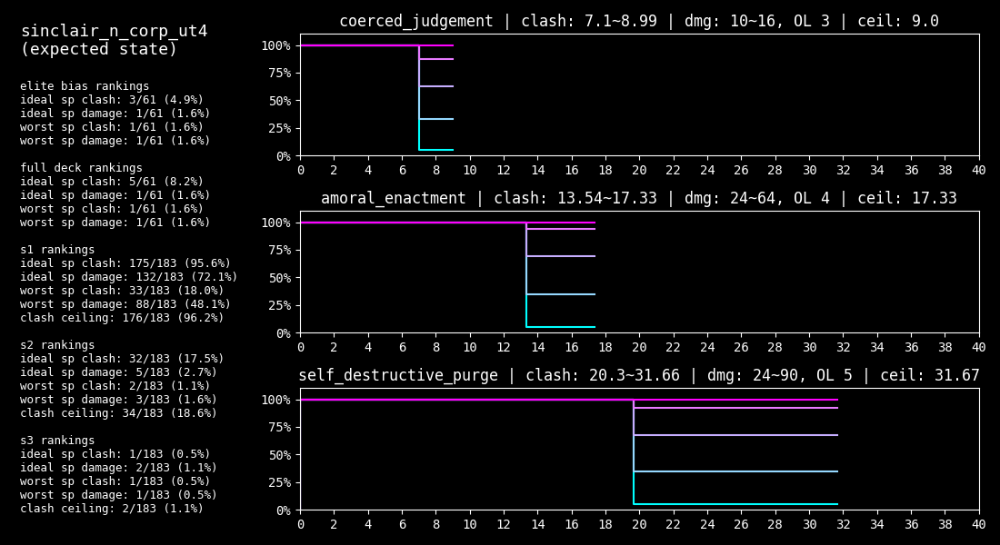

\+ Minus coins provide an unprecedently strong baseline clash power, since destroyed coins are unable to lower skill clash power  
\+ Unrolled damage coins are treated as tails rolls, giving skills a powerful first hit, which also opens up new ways to play around stagger thresholds  
\+ Corrosion tempo tech allows him to act during stagger or manifest EGO without paying resource costs  
\+ Strangely powerful defensive skill that does not interfere with sin generation and offers a means of controlling sanity when anticipating high drops  
\+ Control over sanity scales with the number of actions he receives, increasing his consistency when getting the first action or being in small teams  
\+ Different corroded EGO skills may generate with different targets, making indiscriminate targeting more lenient  
\+ Defense skill rolls big and also has a high defense value, making it surprisingly practical for a shield  
\+ Numerous and simple sanity tools keep his kit functional (at least in comparison to Suncliff)  

\- Will effectively never maintain the consistency of plus coin units; kit maximization is impractical  
\- Works worse in a full team due to the higher chance of hitting allies and marginally worse sanity control  
\- Skipping EGO in favour of panic invokes a heavy opportunity cost, and giving up on sanity management massively reduces his consistency  
\- Strangely low defense (but offset with a high health pool)  

`Skill 2 and 3 are simply fantastic, Great clasher.`

---

### S Tier: Don Quixote - W Corp. L3 Cleanup Agent

The adverse chart shows Rip Space with insufficient charge.

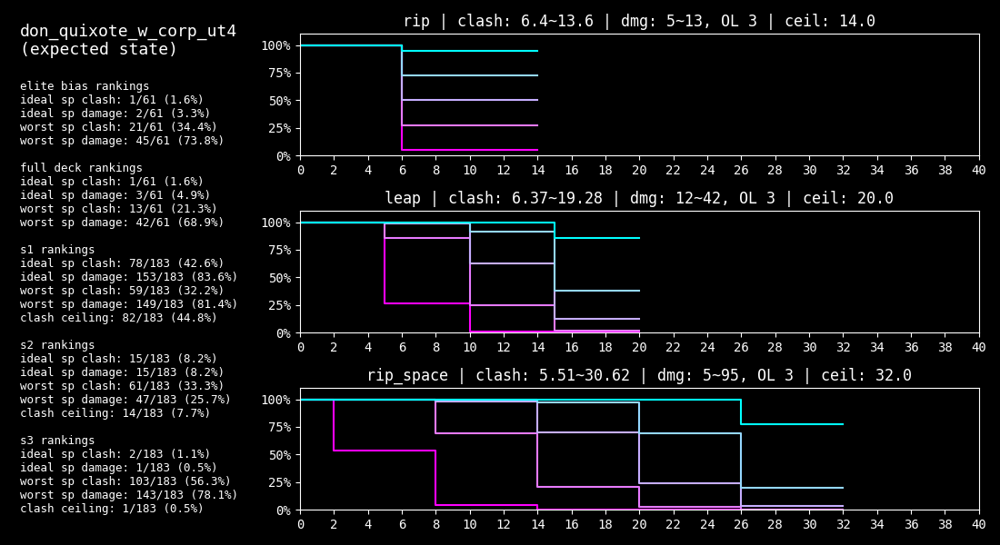
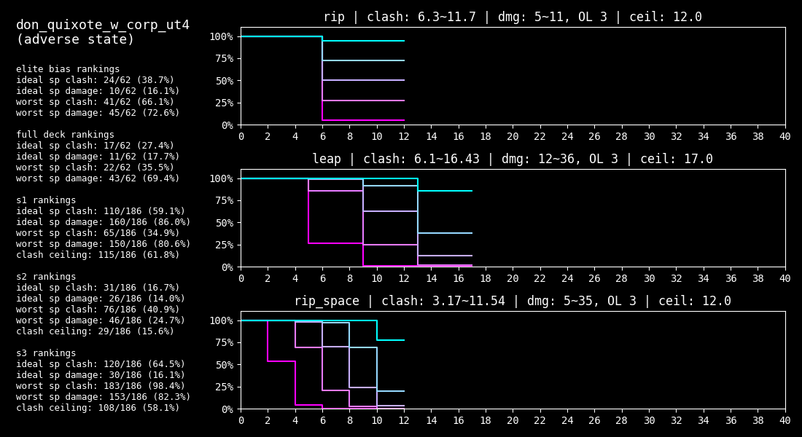

\+ Rewards technical play more than any other identity  
\+ Playing around S3 tempo sets the standard for what high DPS should look like  
\+ Being a charge unit with an evade lends well to high performance solo or small team clears, and causes her to benefit from getting the first action  
\+ S2 inflicts fragile, rewarding tempo control even further  
\+ Manipulating skill order allows charging and firing S3 on the same turn, resulting in good fragile usage and less dead turns  
\+ Well-known synergy with Telepole and a lesser-known synergy with W Faust's support passive, but relies on neither  
\+ S2 and S3 are great at clashing, as befitting an S tier unit  

\- Without UT4, miserable S1 and charge limitations can result in dead turns  
\- Performance degrades significantly or has increased reliance on Telepole when only given one action a turn  
\- Impractical for autobattle (worth mentioning, but does not factor into her ranking)  

*When the space is ripped (clear by Nex)*

---

### S Tier: Heathcliff - R Corp. 4th Pack Rabbit

The prime chart includes +1 power from the passive and +1 power from Bodysack. The adverse chart shows performance at less than 6 speed.

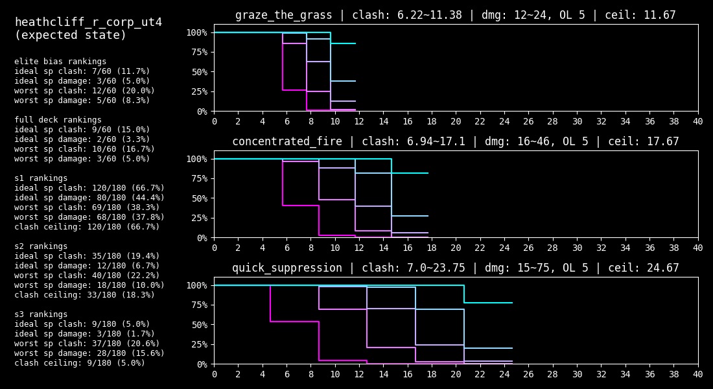
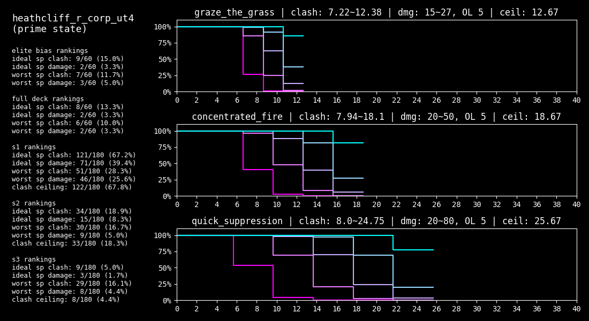
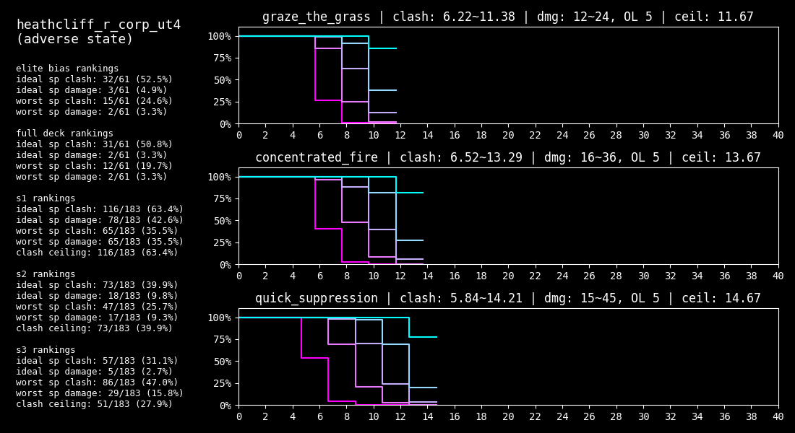

\+ Quick Suppression at 6+ speed performs a similar role to Rip Space  
\+ Tech exists to conserve ammo, such as making him the last action recipient, or using Bodysack to cycle S1 and S2  
\+ Still clashes when out of ammo, neutralizing incoming threats with insane rolls  
\+ Kit effects also add considerably more damage than is standard, with 4 fragile on S3  

\- Despite having an evade, soloing is not advisable due to ammo  

---

### S Tier: Ryoshu - R.B. Chef de Cuisine

The prime chart represents Ryoshu with max damage from ICCA's missing health bonus. Due to reversed offense, please note how this may be misleading.

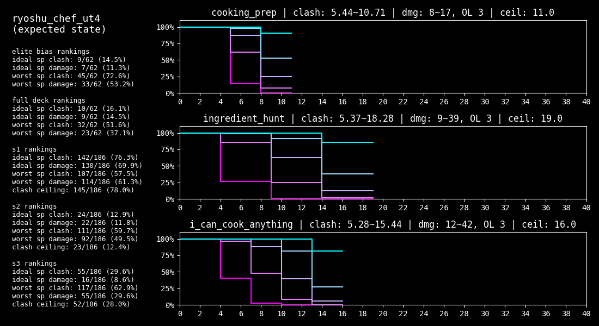
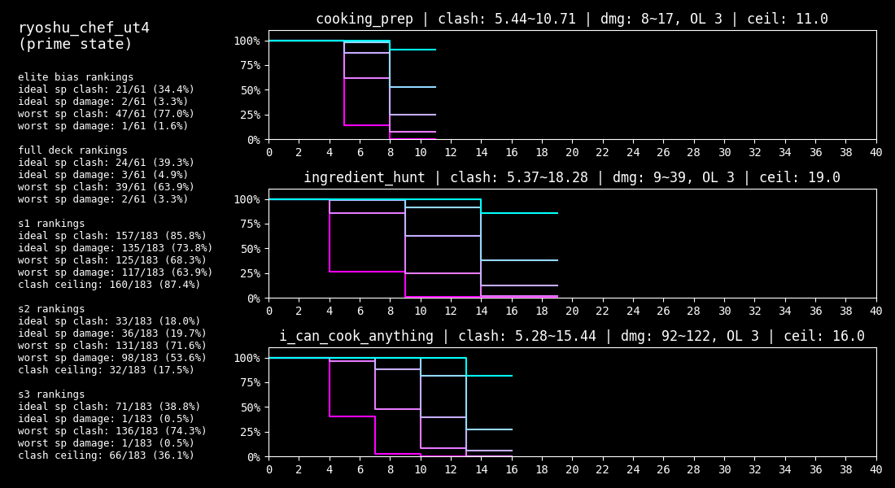

\+ Consistently strong fighter that can be expected to clash and deal damage reliably  
\+ S3 has reversed scaling with enemy defense  
\+ Evade recycles can stack 4th Match Flame, adding tempo to S3  
\+ Viable in low-sinner and solo compositions  
\+ No ammo or charge limitations  
\+ Obligatory mention of her mild team healing sustain  
\+ S3's additional missing health damage experiences reversed offense scaling for some reason  

\- Kit effects are disorganized and stage dependent (but her numbers don't rely on them)  
\- Extremely similar to N Faust, who trades numbers for debuffs

---

### S Tier: Yi Sang - Effloresced E.G.O::Spicebush

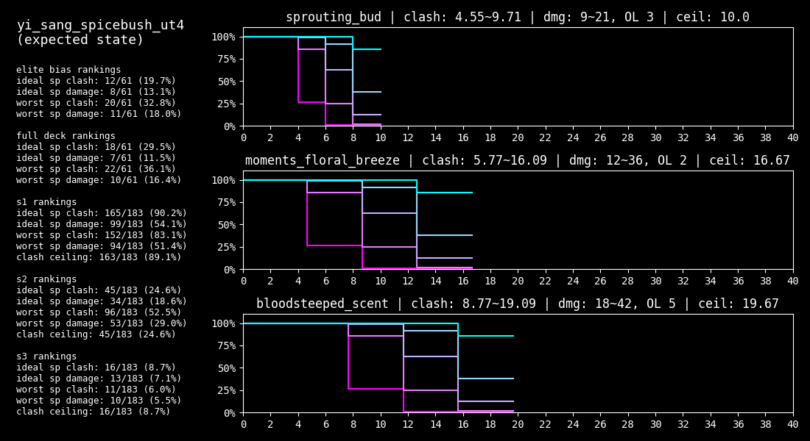

\+ Great clash and damage power from raw roll numbers alone  
\+ Multicoin AoE is insane but situational  

\- Punished harsher against enemies that burst tremor and apply potency (but this is inherently situational and chances are he'll perform well anyways)  
\- S3's deluge is impractical even with heavy sinking investment  

*Tutorial by LIF-tan*

---

### S Tier: Hong Lu - Tingtang Gangleader

The prime chart includes the additional coin on S2 and the full recycle from S3.

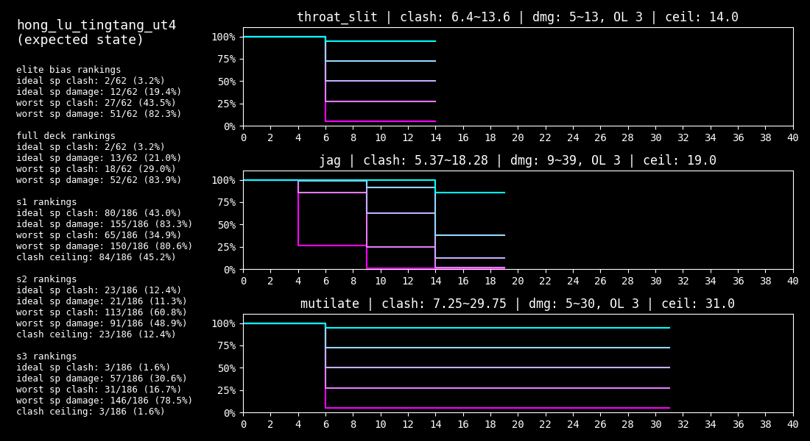
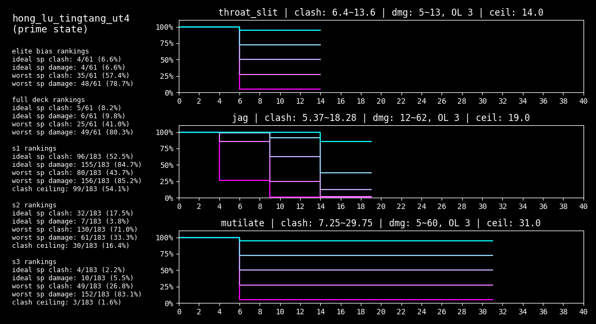

\+ S3's unprecedented clash ceiling reduces dependence on enemy low rolls  
\+ S2's extra coin appears when attacking broken abnormality parts  
\+ Having an evade opens up low-sinner compositions  
\+ Has high defense for some reason  
\+ Kit contributes more damage than usual  
\+ No charge or ammo limitations  

\- Does not tolerate low sanity well (but is slightly offset by his passive)  

---

### S Tier: Ishmael - R Corp. 4th Pack Reindeer

The prime chart includes +1 base power from the passive. Snagharpoon is not represented.

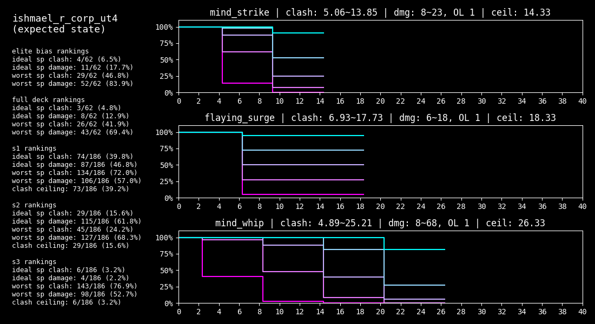

\+ Charge is practically a non-issue with UT4  
\+ Well-rounded kit and powerful tempo  
\+ High rolls make for straightforward fights  
\+ Suffers no consequences when firing uncharged S3 when solo, albeit without being able to clash or choose a target  

\- UT3 is miserable compared to UT4's S3 charge cost and sanity loss reductions  
\- Since S3 deducts charge before the turn begins to resolve, turn order manipulation for charge is not possible (this can be disregarded but is worth mentioning for completeness)  

---

### S Tier: Ishmael - Liu Association South Section 4

The prime chart includes +1 coin power on S3 and +2 coin power on S1 and S2, which are obtained from kit effects.

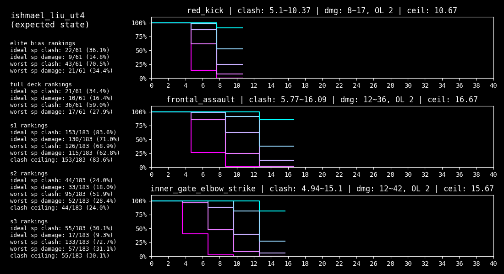
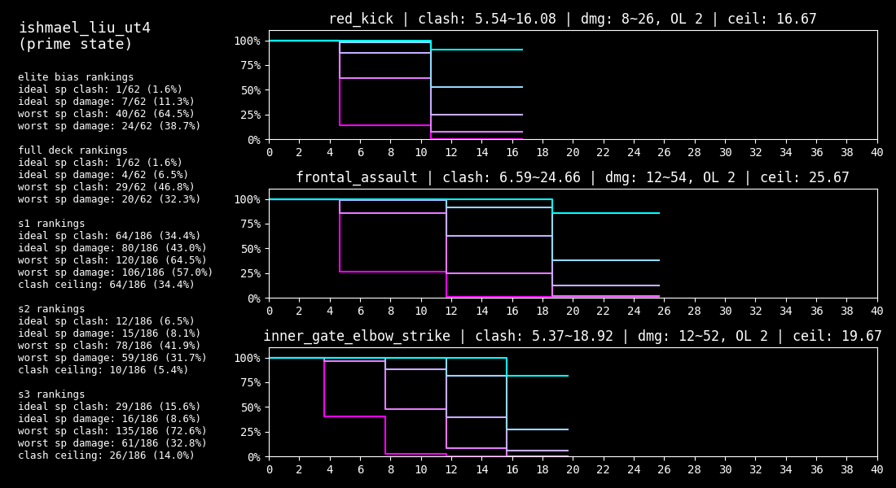

\+ Has strong numbers and cohesive kit effects  
\+ Above average contributions from kit effects  
\+ Capable of operating as a standalone burn unit in a pinch  

\- Exaggerated burn dependence results in volatile performance and team dependency  
\- S3's plus coin boost is only obtained if the fourth coin in the skill performs the stagger or kill, making it impractical to play around  

---

### S Tier: Ishmael - Molar Boatworks Fixer

The adverse chart excludes all coin power, the prime chart includes all coin power, and the expected chart has +1 coin power on S2 and S3.

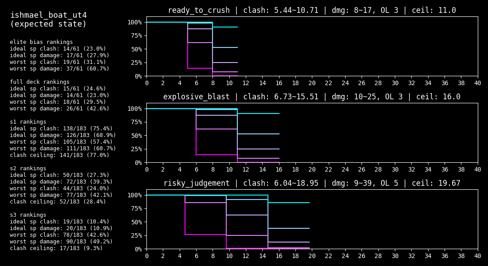
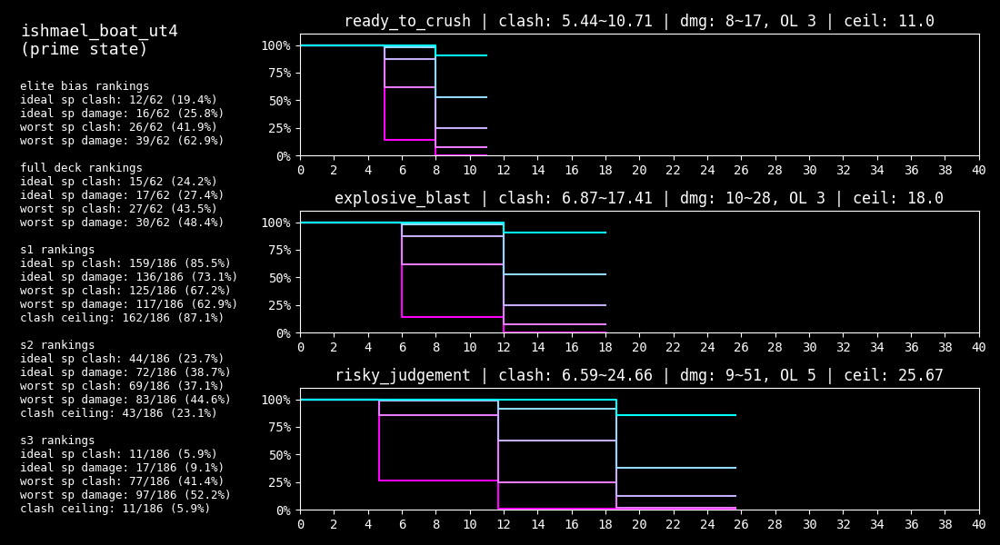

\+ Has powerful kit effects from S3 and S2 on top of solid rolls  
\+ Obligatory mention to her funny high evade min-roll  
\+ Tremor count tempo creates highs and lows to play around (which can be a bad thing)  

\- Passive procs before S2's sinking increase, resulting in 7/1 sinking instead of 6/2 sinking  
\- Stacking sinking or rupture tends to be rather clunky (but generally results in better burst)  

---

### A Tier: Hong Lu - K Corp. Class 3 Excision Staff

The prime chart includes S1's +3 coin power. The adverse chart excludes S3's +2 coin power.

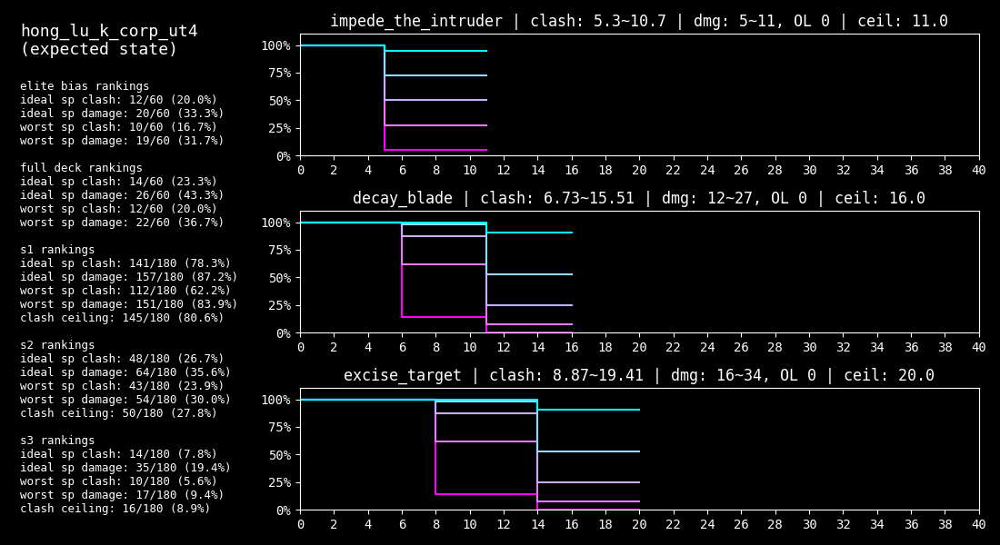
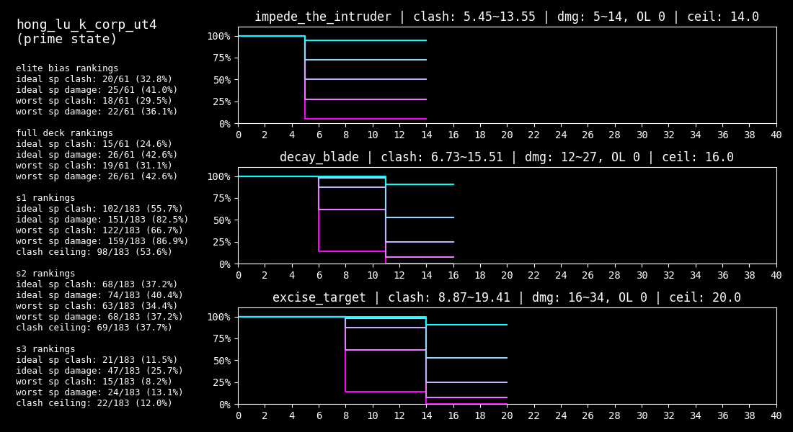
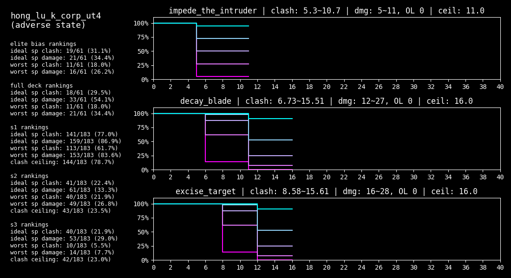

\+ Designated taker of Ls  
\+ Unprecedented survivability from kit effects and health, defense and stagger stats  
\+ Aggro and decent speed allow for high taunt coverage, exploiting the previous point  
\+ Still has decent rolls despite everything  
\+ Reviving from a ampule related death using Dimension Shredder's passive results in obtaining an extra ampule (this has not been verified by any of the authors)  

\- Likely outcompeted when optimizing speed clears due to a lack of focus on damage  

---

### A Tier: Faust - The One Who Grips

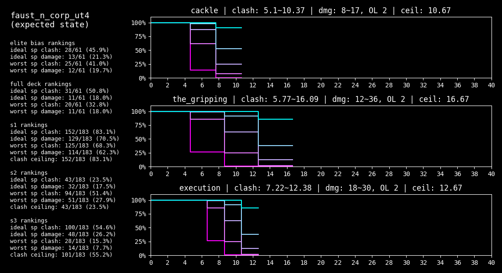

\+ S2 oriented with high damage from multicoins  
\+ No ammo or charge limitations  
\+ Fares consistently and reliably with her great numbers  
\+ Debuffs from kit effects provide easily capitalizable tempo  
\+ Highest potential for sanity restoration to fuel EGO spam  

\- Passives demand building around lust resonance  
\- Extremely similar to Chef Ryoshu, who trades debuffs for better numbers  
\- Gained less than most identities after offense changes, even after the second patch  

---

### A Tier: Rodion - Rosespanner Workshop Representative

The adverse chart excludes S2's extra coins.

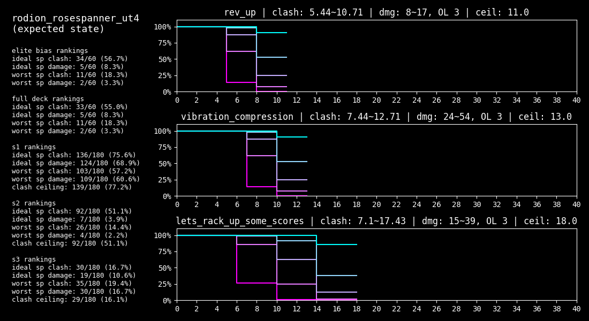
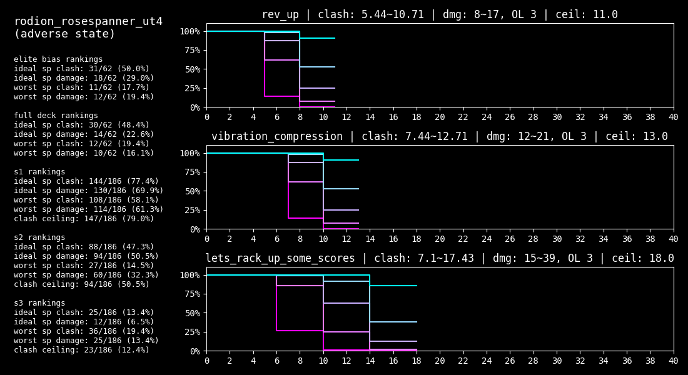

\+ Well-rounded damage spread across all three skills, with bias to S2  
\+ Consistently powerful damage rolls  
\+ Functions as a standalone tremor unit, opening up potential future synergies  

\- Relatively poor clashing power  
\- Tremor and stagger threshold manipulation are not that remarkable on their own  

---

### A Tier: Don Quixote - Cinq Association South Section 5 Director

The prime chart includes her coin power on S1 and S3, as well as +1 clash power from S3.

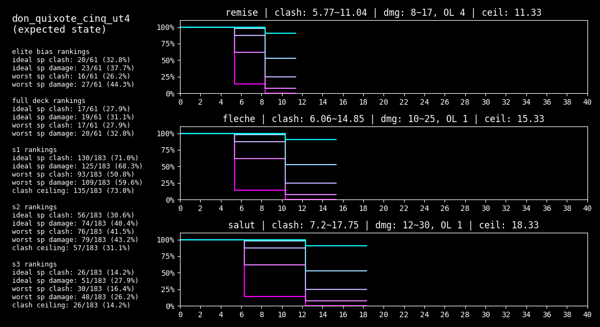
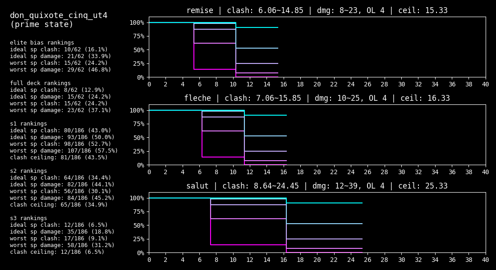

\+ Decent rolls and unique targeting pressure from declared duel  
\+ Speed shenanigans increase player agency  
\+ Clash count damage scaling opens up tie gambling for low-turn clears which hopefully will not become a thing for the sake of player sanity  

\- Kit effects typically contribute less damage than usual  

---

### A Tier: Faust - Lobotomy Corp. Remnant

The adverse chart excludes S3's +3 coin power.

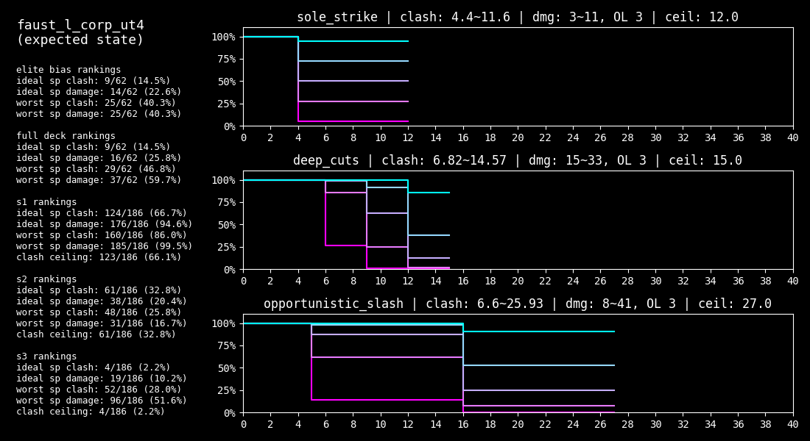
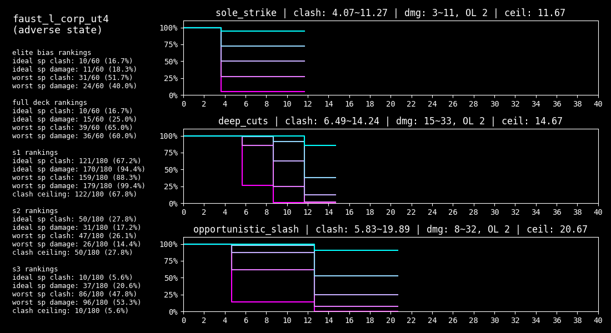

\+ Part of the low rarity clash god trio with 7S Ryoshu and Shi Don, who all play similarly  
\+ High-end rolls translate to solid clashes and acceptable damage  
\+ Haste from S2 provides great pulling power, allowing her to put her insane clash power to use, making her an extremely competent fighter  

\- Remarkably poor stagger thresholds, making her feel somewhat glassy  

---

### A Tier: Yi Sang - Blade Lineage Salsu

The adverse, expected and prime charts include 0, +1 and +3 coin power respectively.

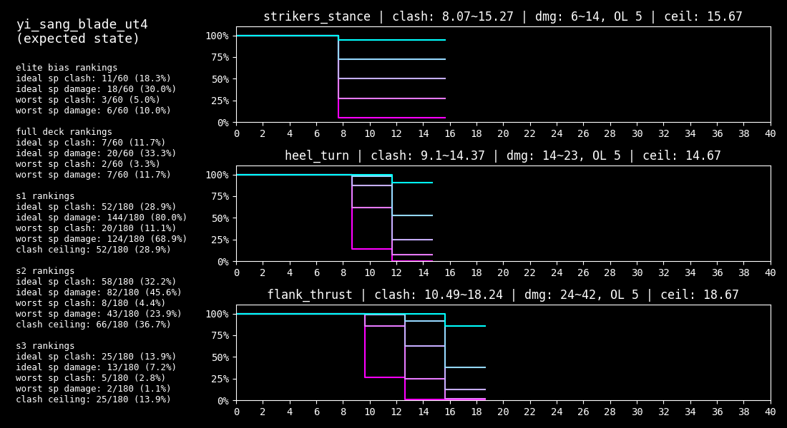
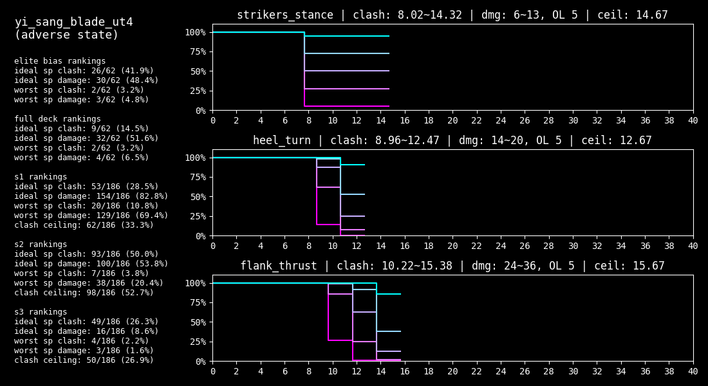
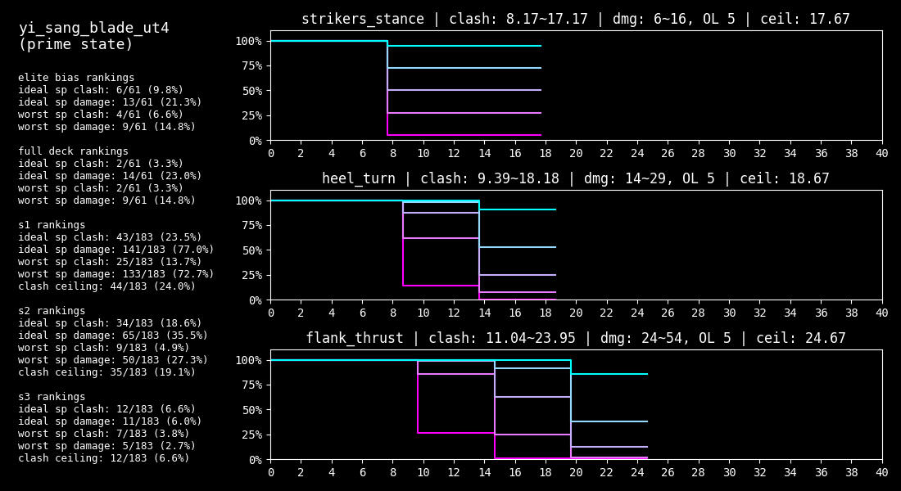

\+ Cohesive kit that plays around S1 to stack passive  
\+ Performs consistently regardless of sanity without poise  
\+ S2 and S3 scale well with the coin power provided by his passive  

\- Obtaining too much poise potency and blindly firing S3 makes it clunky to accumulate poise count (but the extra damage may make up for it)  
\- Relative lack of poise count and complete lack of coin power make his UT3 miserable  

---

### A Tier: Gregor - G Corp. Manager Corporal

The prime chart includes his coin power on S1 and S3.

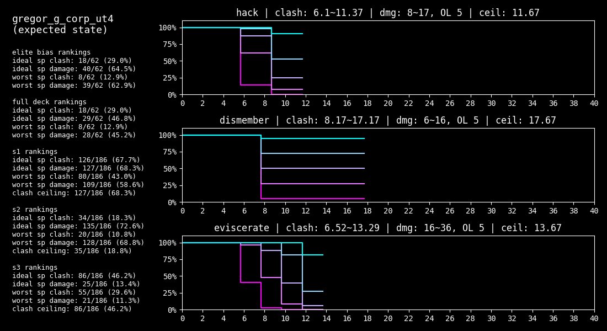
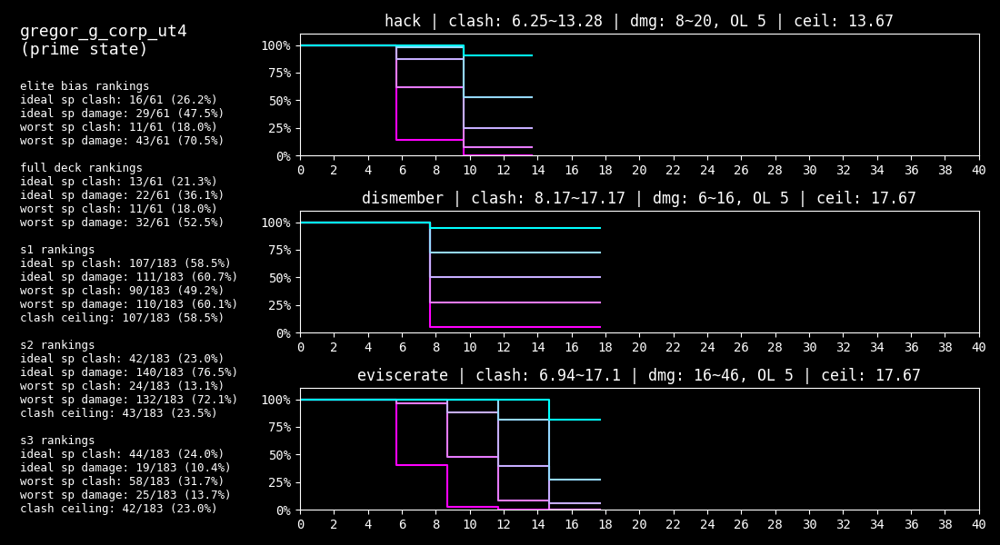

\+ Contrary to intuition, has virtually identical clashes to 7S Outis due to their difference in offense level  
\+ Kit provides so much healing that he will generally be able to shrug off lost clashes with little to no consequence  
\+ Surprisingly fast for a tank, giving him the ability to pull dangerous skills away from core units  
\+ Deliberately allowing him to stagger and healing him up during low pressure effectively removes his own stagger thresholds for later rounds  
\+ Piloting him feels like giving the team a regenerating frontal shield, enabling heavy damage payloads (e.g. Cloud Cutter) to land without risking a clash (but this applies to tanks in general)  
\+ Building around Legerdemain allows him to take on a damage role  

\- Happens to be the author's favourite unit (so take that bias as you will)  

---

### A Tier: Outis - Seven Association South Section 6 Director

The prime chart includes her coin power on S3.

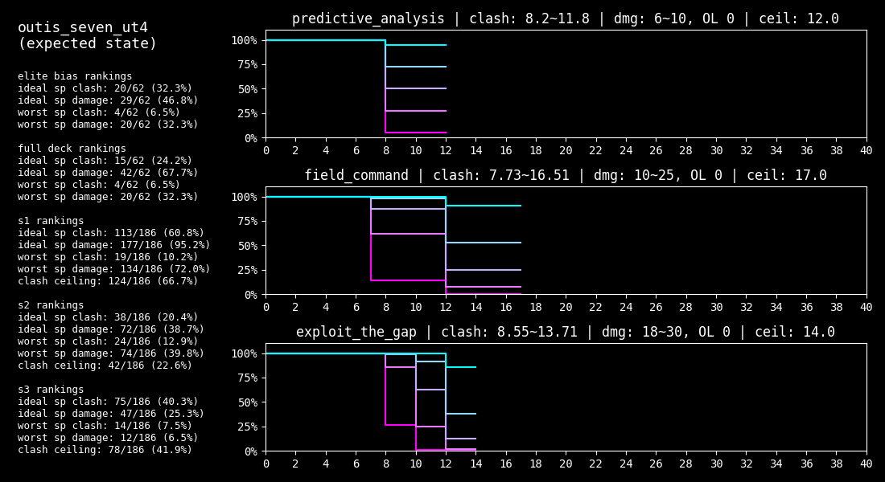
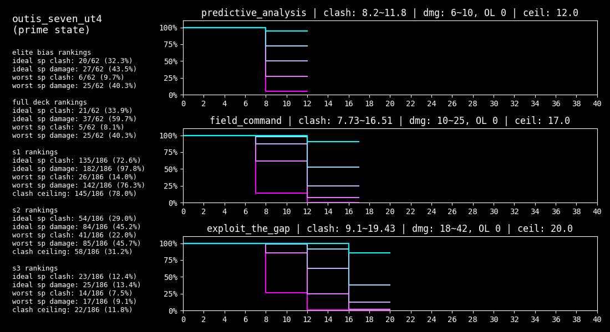

\+ Can be thought of as a less durable but more explicitly supportive version of G Gregor  
\+ Kit has far more debuffs than usual  
\+ Paralysis on S1 and offense down on S3 make it easier for the team to win clashes  
\+ High speed allows her to pull clashes reliably  
\+ High defense and only one stagger threshold also allows her to tank the clashes she can't win  

\- Despite her public opinion of being a great clasher, the numerical truth is that her clash power is not that remarkable  
\- Damage attributed to her defense level down and weakness analyzed debuffs often does not compensate for her poor numbers  
\- Having lots of effective health is rarely preferable to regeneration  

---

### A Tier: Ryoshu - Seven Association South Section 6

The prime chart represents Ryoshu with Upper Slash's effect and next turn +1 attack power active.

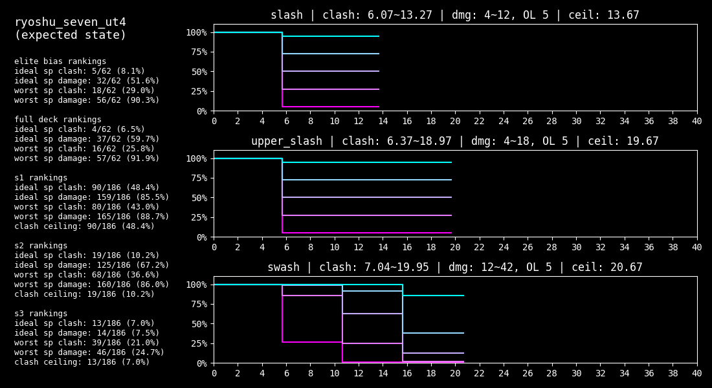
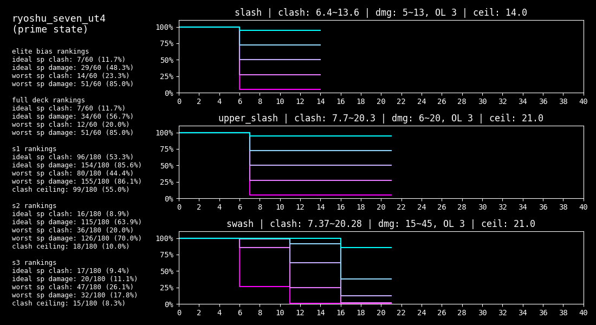

\+ Part of the low rarity clash god trio with L Faust and Shi Don, who all play similarly  
\+ Above average roll numbers make her solid to pilot  
\+ Kit provides an unprecedented amount of slash fragility, contributing a significant amount of damage  
\+ Clash win effects in her kit press her advantage of having excellent rolls  
\+ S3 contributes even more in low-sinner teams (but having a counter instead of an evade can reduce her effectiveness)  

\- Raw damage is more concentrated in S3 and lower overall compared to L Faust and Shi Don  

---

### A Tier: Don Quixote - Shi Section 5 Director

The prime chart includes S3's base power.

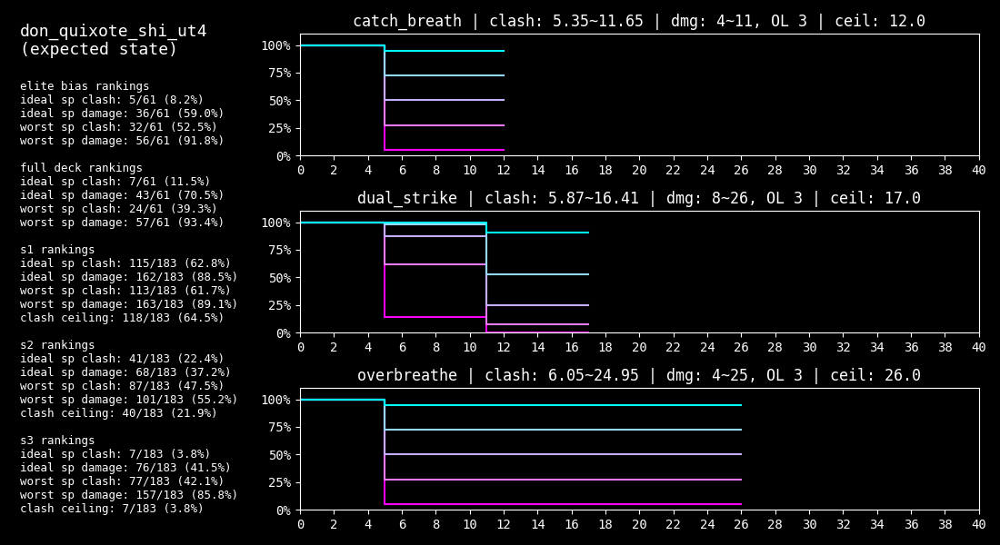
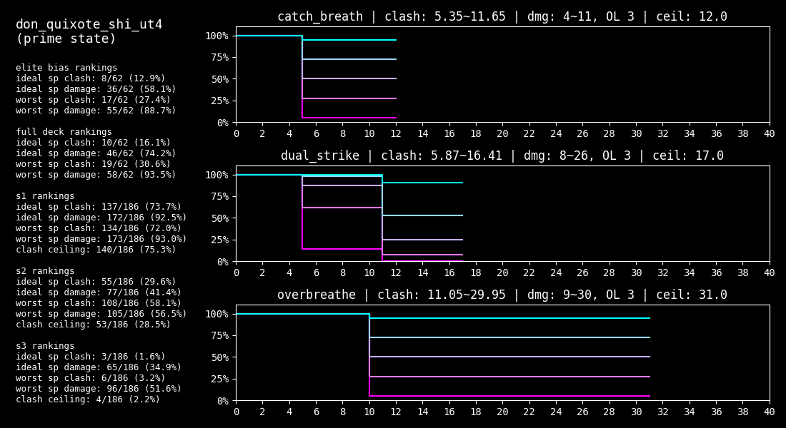

\+ Part of the low rarity clash god trio with L Faust and 7S Ryoshu, who all play similarly  
\+ Has the highest clash power of the trio at the cost of having the lowest damage  
\+ Gains haste from her S2 and passive, giving her the speed she needs to maximize her clashes  
\+ Only has two stagger thresholds, making her more forgiving than intuition would suggest  

\- Outstanding clash power often does not compensate for having poor damage  

---

### A Tier: Hong Lu - Kurokumo Wakashu

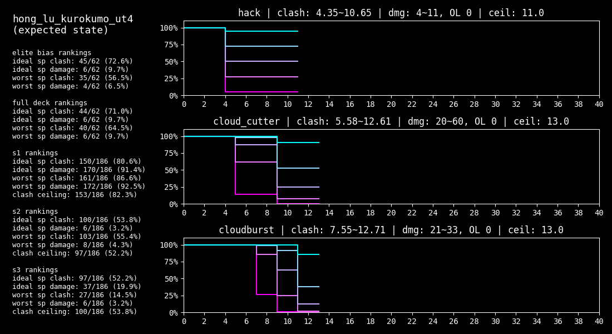

\+ Cloud cutter.

---

### A Tier: Heathcliff - Lobotomy E.G.O::Sunshower

The adverse, expected and prime charts include 0, +2 and +3 base power on S2 respectively.

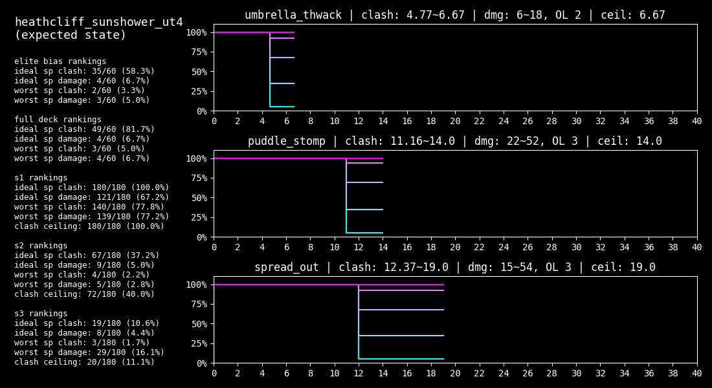
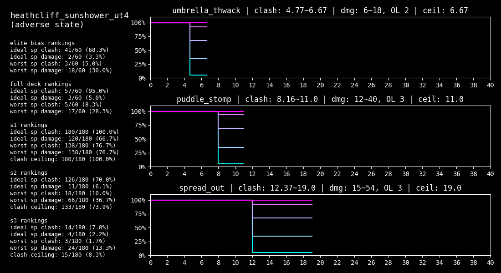
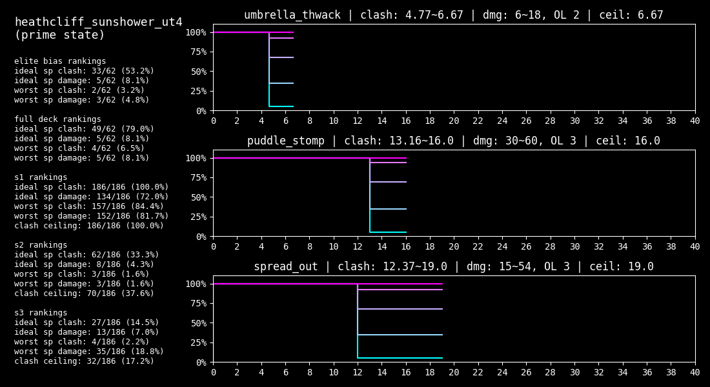

\+ Theoretical damage output rivals that of S tier units (but is held back by an extremely clunky kit)  
\+ Kit effects are synergistic and contribute much more damage and survivability than is standard  
\+ Most viable Heathcliff identity for EGO spam  
\+ Similar to G Gregor with Legerdemain, Suncliff has notable synergy with AEDD  
\+ Strong counter skill is inherent to his gameplay without sacrificing damage tempo  
\+ Like Ninclair, benefits greatly from being the first action recipient  

\- Clashes are surprisingly bad, even for a negative coin unit (but many aspects of his kit can play off this)  
\- Sinking micro does not so much reward forward thinking as punish a lack of it  
\- Sinking stacks are not preserved between fights, exacerbating his slow ramping time  
\- Somewhat reliant on being hit to accelerate sinking, which can lead to unintentional corrosions or staggers (but the latter is offset slightly from AEDD's passive or other sources of healing)  
\- Requires the team to be built around him and will not be able to function smoothly in random squads  
\- Benefits more from being max level than usual  

---

### B Tier: Ishmael - Shi Section 5

The prime chart represents Ishmael with Flashing Strike's additional coins.

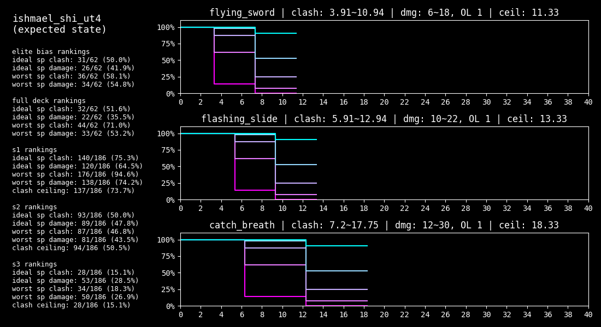
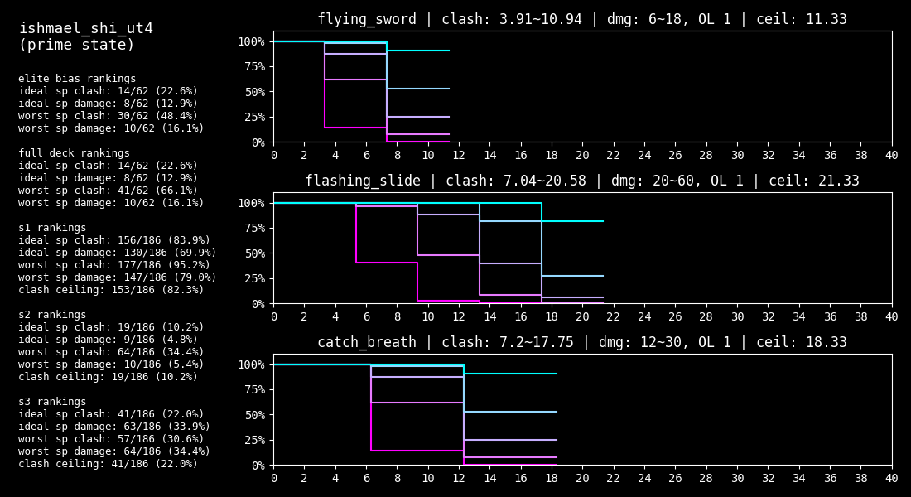

\+ Decent clash power while above her health threshold  
\+ Gains incredibly high numbers and performance in her prime state  
\+ Keeping her at UT2 to avoid diluting her skill pool is speculated to result in better performance  

\- Below average damage while above her health threshold  
\- Maintaining her prime state is impractical outside of Refraction Railway  
\- Needing to go through at least one stagger forces dead turns  
\- Unwanted healing priority can be awkward to manage  

---

### B Tier: Ryoshu - Kurokumo Wakashu

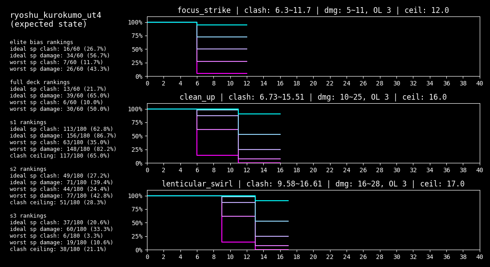

\+ Decent rolls  
\+ Inflicts bleed count, making the status effect more impactful  

\- Damage contributed by bleed is substandard compared to just using skills with bigger numbers  
\- Bleed relies on the target to attack, making it miserable when targeting a broken part or staggered enemy, or at least less controllable compared to other statuses  
\- Other parts of her kit apply on the same turn and are relatively unimpactful  

---

### B Tier: Outis - LCB Sinner

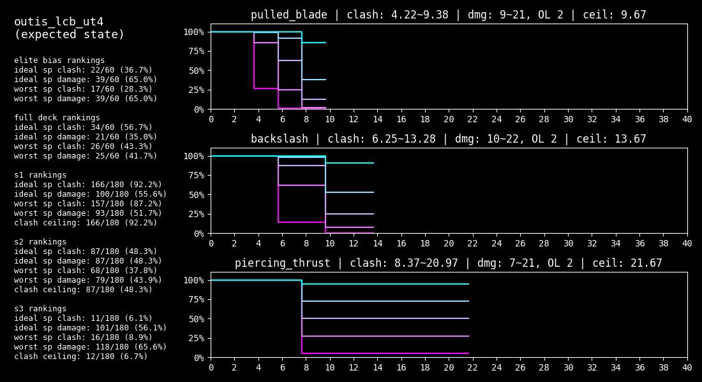

\+ Great damage and decent clashes make for a surprisingly workable identity  
\+ Workable S1 gives her a rare tempo, and serves as a solid tool to clean up staggered targets or exploit skills that are easy to clash  
\+ Hit effects contribute a lot more damage than is standard  

\- May be directly outperformed by higher tier damage-oriented identities  

---

### B Tier: Hong Lu - LCB Sinner

The adverse chart represents Hong Lu without the additional coin power on S2 and S3.

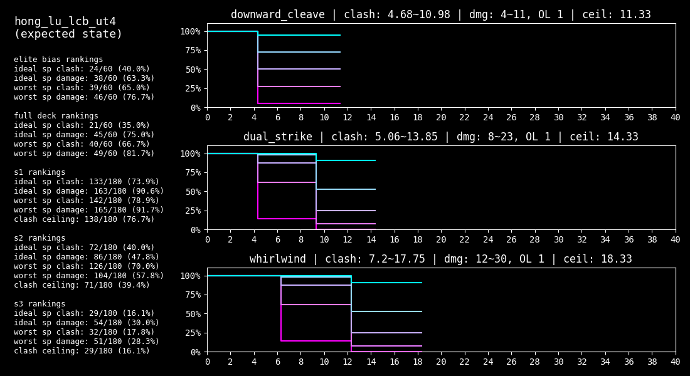
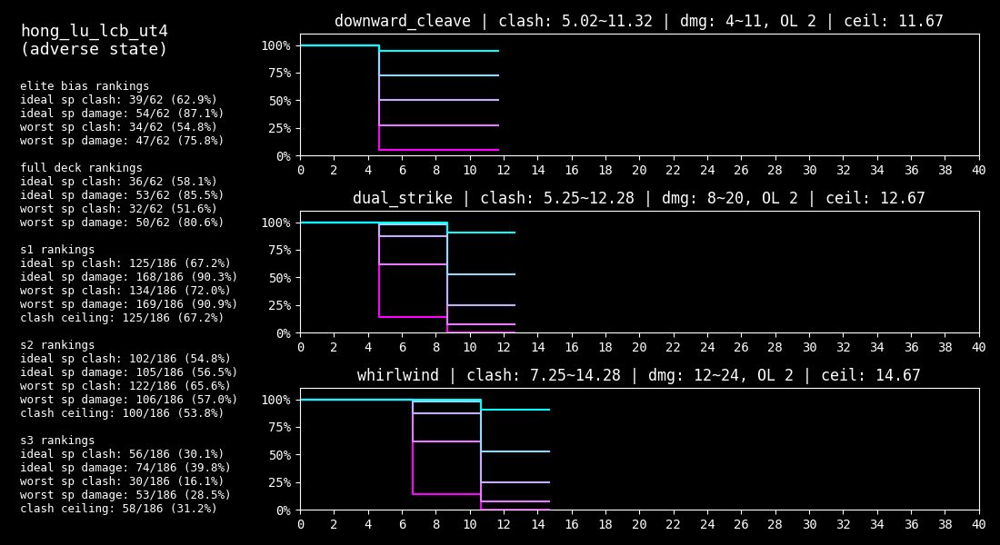

\+ Decent damage and reliable clashes  
\+ S2 and S3 behave similarly and provide a powerful baseline performance  

\- Kit effects contribute less damage than is standard  
\- Attack power down on S3 also applies on the same turn, making it somewhat limited  

---

### B Tier: Rodion - Kurokumo Wakashu

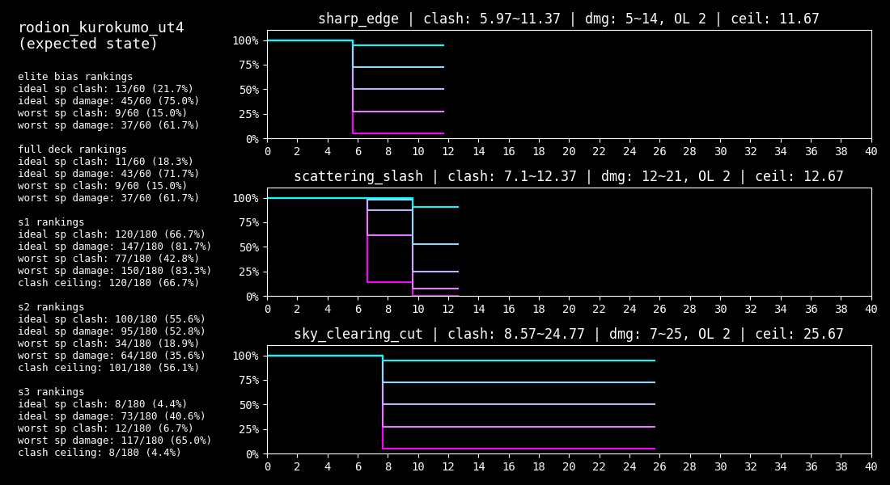
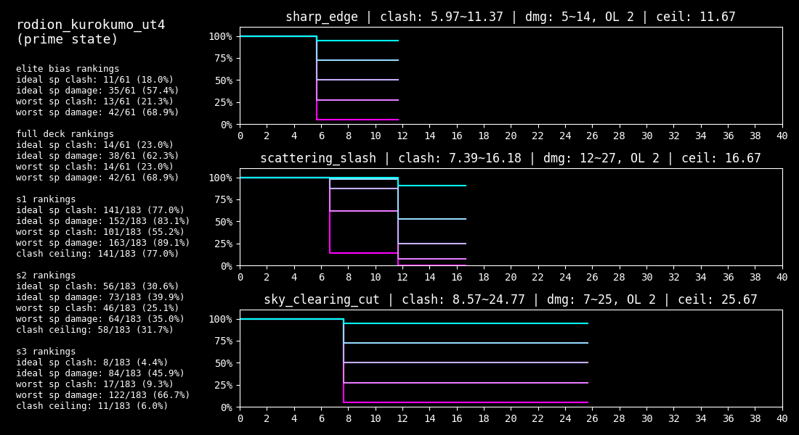

\+ Serviceable rolls and a mildly clunky kit make her playable but generally unremarkable  
\+ Notably high base power on her S2 and S3, lessening dependence on RNG in low sanity scenarios  
\+ Gains a slew of kit effects and roll bonuses at UT4  
\+ Notable synergy with BL Yi Sang's support passive  

\- S3 effects are restrictive due to lacking count for both her bleed and poise, requiring additional effort to build around for maximization  
\- Passive theoretically has a powerful tempo, but finding situations that favour countering over clashing requires creativity  

---

### B Tier: Sinclair - Blade Lineage Salsu

The prime chart includes +2 base power from S2. The adverse chart excludes the coin power from S1.

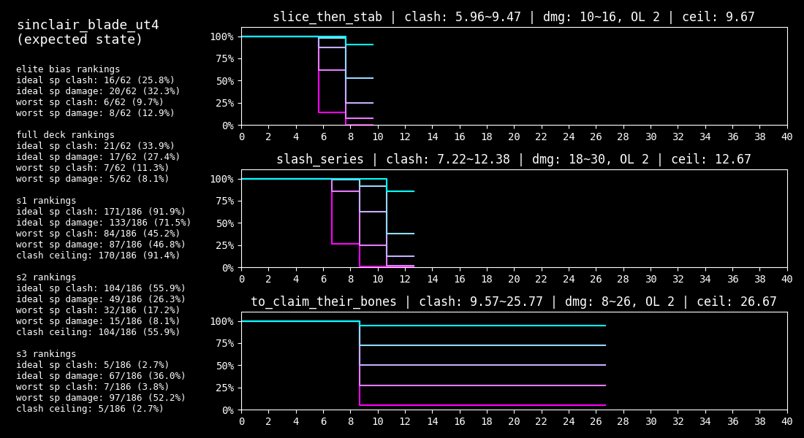
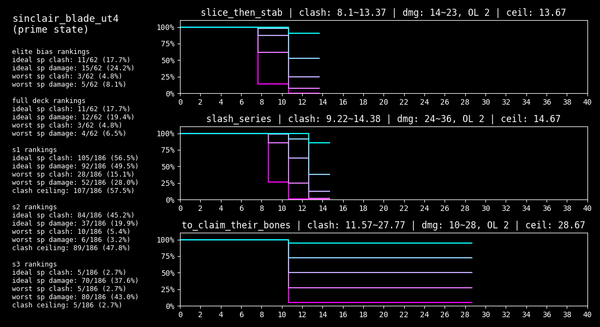
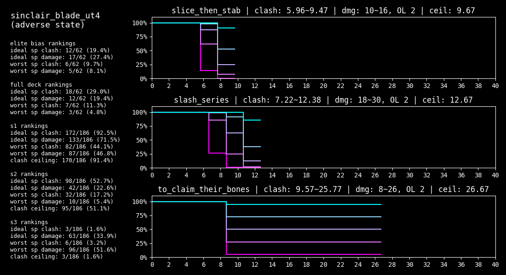

A bit about Blade Lineage identities:

While L Faust, 7S Ryoshu and Shi Don achieve excellence at their best, BL Yi Sang and BL Sinclair are capable of performing consistently in dicey situations. The distinction comes from how their skills are balanced— the former has high highs and low lows, and vice versa. Furthermore, most of the former have evades, and these two have counters, furthering this "constant output" philosophy. This causes the former trio to have amazing rolls once scaled to max sanity, while the latter will remain consistent but relatively unimpactful. This is represented by the former's high variance, and vice versa. If consistency is what one seeks, these two are likely to perform the same regardless of whether they're rolling heads or tails, giving them fairly good low sanity tolerance. 

However, in this snowball, high sanity meta where 95% heads is common, units that favour base power tend to underperform. Despite how consistently these skills can achieve their expected clash power, they probably will still rely on the opposing skill to low roll due to their low aggregate, ironically making them arguably less consistent than coin power oriented units.

Edit: This was written in the early days of Limbus Company.

\+ S3 can function as a pseudo-ego  
\+ Kit effects are functional  

\- Does not make use of max sanity remotely as well as units with coin power  

### B Tier: Heathcliff - Shi Section 5

The prime chart includes the base power bonuses from his health threshold.

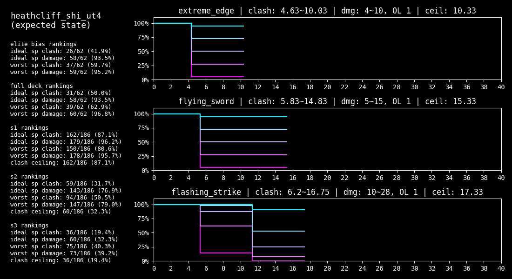
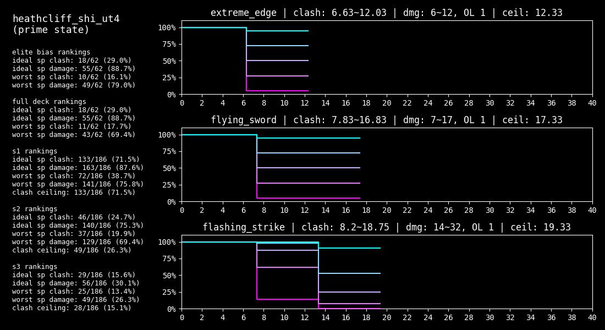

\+ Despite his poor reputation prior to the UT4 update, Shi Heathcliff's clashes are relatively okay  
\+ Viable when played normally and gains attack weight in prime conditions

\- Health threshold micro often makes healing impractical

---

### B Tier: Gregor - Liu Association South Section 6

The prime chart represents Gregor with +1 power from his S2 effects.

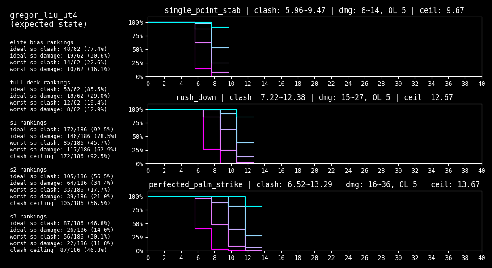
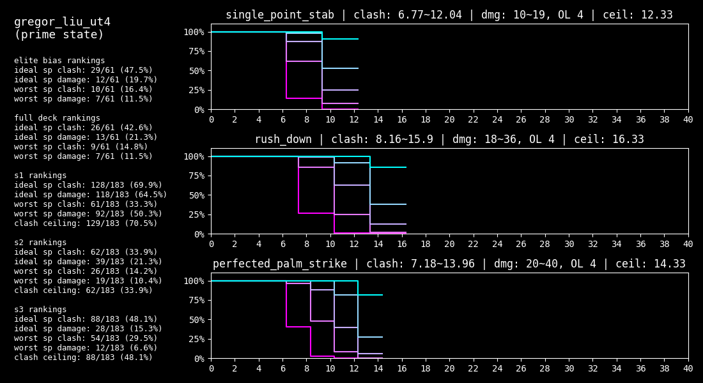

A bit about Liu Association identities:

The Liu Association can be summarized as favouring damage over clashes. Due to how their burn stacks play into each other, their kit effects will contribute more and more depending on how hard burn is being funneled. For maximization, utilizing all three is recommended, even if some of them are merely used to provide their support passive. Additionally, they will perform best when there is one centralized unit to stack burn upon.

\+ Contributes the most burn potency of the Liu trio  
\+ Functions the best as a standalone Liu unit, taking on the role of a high damage unit with S3 tempo  
\+ Highest speed out of the trio  

\- Outside of S3, plays somewhat similarly to Blade Lineage units, relying on low variance and high coin count to win clashes by waiting for enemies to low roll  
\- On the glassier side in terms of health and defense  

---

### B Tier: Ishmael - LCCB Assistant Manager

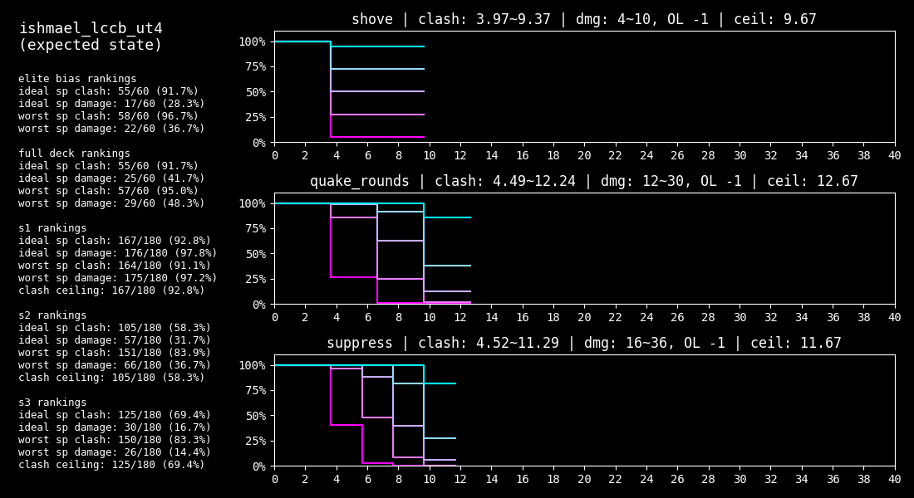

\+ Contributions come almost entirely from powerful debuffs on S3  
\+ Opens up extreme low-turn strategies in reset heavy contexts  
\+ Applying a myriad of statuses makes her likely to find synergies  
\+ Plays like a discount R Heathcliff with less ammo consumption  

\- Paralysis and attack down on S1 and S2 are applied on the same turn, limiting their effectiveness  
\- Terrible roll numbers and ammo limitations make her generally impractical  
\- Used almost exclusively to reset until she can fire S3 turn one in battles that take less than a couple turns  

---

### C Tier: Hong Lu - Liu Section 5

The prime chart includes coin power on S2 and S3.

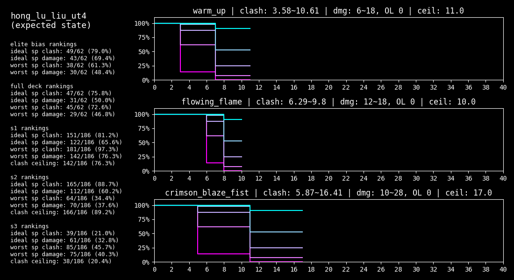
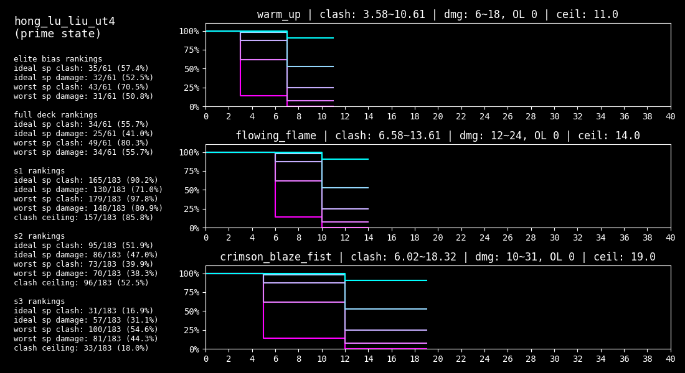

\+ Most clash-oriented of the Liu trio, while still playing into the philosophy of multicoin damage  
\+ Contributes the much needed burn count for burn funnel, but the least burn potency  
\+ Surprisingly tanky too— has higher defense and one less stagger threshold than Liu Meursault  

\- Slightly miserable offense level, making his damage deceptively lower than raws would suggest  

---

### C Tier: Meursault - Liu Association South Section 6

The prime chart includes coin power on S3.

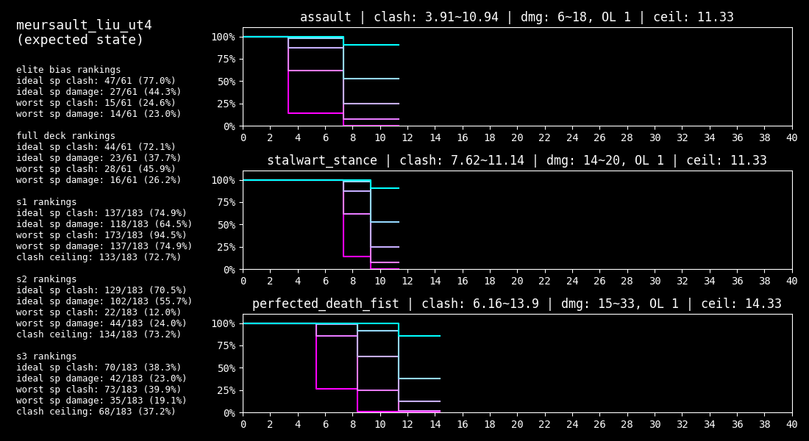
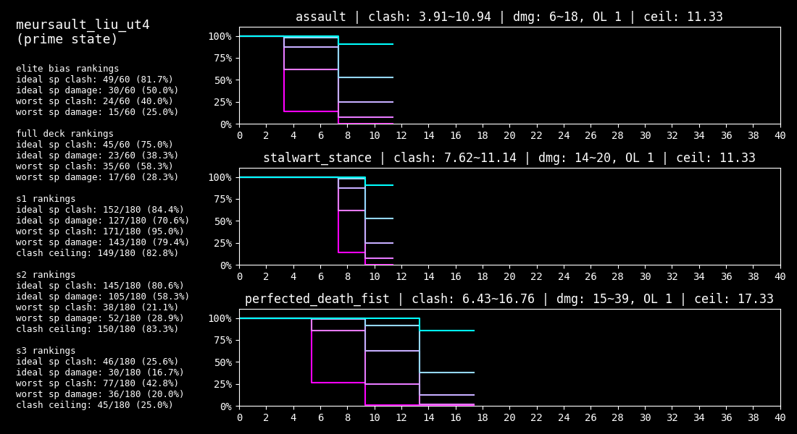

\+ Forms the middle ground of the three Liu identities  
\+ Contributes both potency and count, but cannot practically sustain the burn count on his own with only one or two actions  
\+ S2 and S3 effects are capable of choosing the same target multiple times, maintaining his kit effect contributions in encounters with fewer enemies  

\- Being mediocre at everything makes for a rather mediocre unit  
\- Arguably the easiest one to bench  

---

## Additional Notes

The 000 Ishmael identities have been grouped together to emphasize that owning one of them is likely sufficient for most accounts. Their differences in power pale in comparison to whatever influences enemy weaknesses would impose. If this statement were disregarded, a case could be made for dropping Boat Ishmael to A tier and maybe having K Corp Hong Lu take her place.

One thing to keep in mind is that stronger units do not necessarily correlate with more enjoyment. Weaker sinners tend to compensate their lack of power in their own strange ways, and giving them a chance tends to lead to making some funny memories. Additionally, the game in its current state is easy enough to comfortably clear with just a support unit, so there's no need to worry about accessibility yet.

As of late July, some of the authors are disappointed in Project Moon. Future updates will be posted when the authors feel like it.