<!-- TODO include "max clash" on s1, s2, s3 -->

<meta property="og:title" content="Yet Another Limbus Company Tier List">
<meta property="og:description" content="A Limbus Company tier list based on numerical analysis, supported by experience.">
<head>
	<link rel="shortcut icon" type="image/png" href="/assets/favicon.png?">
	<link rel="shortcut icon" type="image/x-icon" href="/assets/favicon.ico?">
	<link rel="icon" type="image/png" href="/assets/favicon.png?">
	<link rel="icon" type="image/x-icon" href="/assets/favicon.ico?">
</head>
<link rel="shortcut icon" type="image/png" href="/assets/favicon.png?">
<link rel="shortcut icon" type="image/x-icon" href="/assets/favicon.ico?">
<link rel="icon" type="image/png" href="/assets/favicon.png?">
<link rel="icon" type="image/x-icon" href="/assets/favicon.ico?">

# Yet Another Limbus Company Tier List

Written and maintained by a math-obsessed psychopath, LOWERCASE (null_machine).

Critically reviewed by Nex (nex7448) and Kervina.

[The analysis tool this tier list is based on can be found here. Everyone's charts can be found here as well.](https://github.com/null-machine/limbus-company-clash-tool)

Limbus Company belongs to Project Moon.

Last update: 2023.6

Note: No new identities will be added until 2023.7.20 update is released, for ease of maintenance. Nex wishes to try out UT4 units before making judgement calls, so this update will likely take a while. However, it's LOWERCASE will probably have generated all the charts for both UT3 and UT4 units before then, so just use their data rankings combined with common sense for the time being.

---

## Table of Contents

Pressing HOME on the keyboard will scroll to the top of the page.

* TOC
{:toc}

---

## Introduction

This is an encounter-agnostic tier list that attempts to rank sinners by general relevance. The rankings may be used for rerolling, as a banner guide, or simply providing a second opinion. Please note that the writeups are geared towards experienced players.

The rationale behind a sinner's rank will never be based solely on their performance in existing content to emphasize future viability. First and foremost, the numbers on their rolls will be analyzed in detail to approximate their ability to clash and deal damage, since this ability is universal and critical. Then, notable parts about their kit that compensate or undermine their numbers will be taken into account. Example strategies and experiences will be provided if appropriate.

Through this metric, it becomes apparent that some sinners will likely be able to directly outperform other options in a large number of cases, and this forms the basis of evaluation. If a sinner becoming unsuitable implies that a sizable chunk of the cast will also become inviable, they probably have high relevance and will remain relatively future-proof.

What this means is, this list will make the game experience and future stages as accessible as possible. Investing in high-tier units will provide a practical way to clear content. Failing that, it will illustrate the opportunity cost of not having certain units (which is usually far more acceptable than influencers would suggest).

Regardless, please recognize that all tier lists, including this one, are generalizations. Cases that favour units of lower tiers will always exist, especially when it comes to playing around sin resources, type weaknesses and edge case synergies. It is unrealistic to expect any tier list to take every single aspect into account, but this one hopefully provides a solid analysis by combining objective numbers with veteran experience.

Finally, let it be emphasized that this is __not__ an autobattle tier list. Knowing how to redirect clashes, cancel enemy actions, pace skill pools and manipulate skill order within a turn is critical for doing identities justice. Learning those skills will make content far more accessible than whaling for rarity abuse.

---

## Rankings

Sinners within S tier and A tier are deliberately ordered. In other tiers, sinners are grouped by affiliation first, and then ordered based on the average power of the affiliation. This is done to emphasize that not all ordering choices are equally significant. 

Units have badges that denote certain changes.

__Cyan:__ This unit benefits significantly from technical prowess. They may gain more than usual from having multiple actions per turn, emphasize tempo control or require specific techniques to prove their worth. Their power will likely drop significantly when played by autobattle.

__Yellow:__ This unit has a notable support passive. They may be impactful when benched, especially for low-sinner teams. Note that all rankings evaluate fielded performance, so this badge serves as a footnote on how an identity may stay relevant despite their rank.

__Magenta:__ This unit may be heavily reliant on RNG or have maximization requirements that can be more time-consuming than difficult. They may be an option for optimizing low turn clears, but be impractical in other settings.

__Red:__ This unit's rank is highly-contested. These sinners may excel in one aspect while severely lacking another, resulting in a volatile rank that depends on what individual players value more. Individuals are highly encouraged to rank this unit themselves. Chances are, the creators probably came to a stalemate and their ranking is a compromise.

__Green:__ This unit gains abnormally high power from UT4. A heavy investment cost is necessary for them to earn their rank. Certain UT4 EGOs may also be integral to their performance.

---

**S TIER — META**

Units in this tier tend to directly outperform or invalidate units in lower tiers. Typing aside, if they can't make a clear work, it's unlikely replacing them will help. At some points, using them almost feels like cheating. This tier is ordered deliberately.

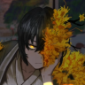

---

**A TIER — RELIABLE**

These units win clashes that units in lower tiers couldn't, and can be relied upon to hold their own and pull their weight. They feel solid to pilot and their kits are easily appreciated. This tier is ordered deliberately.

---

**B TIER — MEDIOCRE**

Neither great nor terrible, these units may leave a player idly wishing they were someone else. That being said, they aren't liabilities.

---

**C TIER — TECHNICAL**

One must go out of their way to get these sinners to outperform other options. Whatever specialties they have are likely to be easily made redundant, and their rolls are subpar.

---

**D TIER — CHALLENGING**

These units should not be prioritized for practical combat.

---

## Writeups

This section is geared towards advanced players. New players will still be able to use the rankings as a reroll or banner guide, and will gain appreciation for high-tier units as experience with the game increases.

The coloured lines represent a sinner's chance to beat a power at varying sanity levels. The y-axis represents chance of winning the clash, and the x-axis represents the power of the opposing skill.

"agg" → aggregate, or clash power. This accounts for offense and possible coin destructions on the ally skill.  
"dmg" → raw damage, or the sum of all coins landing. The @ refers to offense level.  

It is impractical to take into account every aspect of every identity for every version of the game. Emphasis will not be placed on skill colours— there's no telling what future EGOs hold in store. Furthermore, Refraction Railway 1 has proven that simply taking strong individual identities will outperform a team that goes out of its way to align colours for EGO spam or resonance. Having rare damage types in the current state of the game will not serve as as a ranking factor for similar reasons. Additionally, EGOs will kept in mind when determining rankings, but only mentioned if they are borderline intertwined with an identity's playstyle (e.g. G Gregor with Legerdemain or SS Heathcliff with AEDD). Micromanaging every single synergy is not practical, so determining how much a sinner's relevance is impacted by the existence of a specific strategy falls to the reader.

For the sake of transparency, let it be known that the author is biased towards G Gregor, N Sinclair, L Faust and W Don, and biased against R Heathcliff, N Rodion and LCCB Ishmael. Everything is still kept as objective as possible.

---

### S Tier: Sinclair - The One Who Shall Grip

The prime chart represents Sinclair with fanatic's +1 power active.

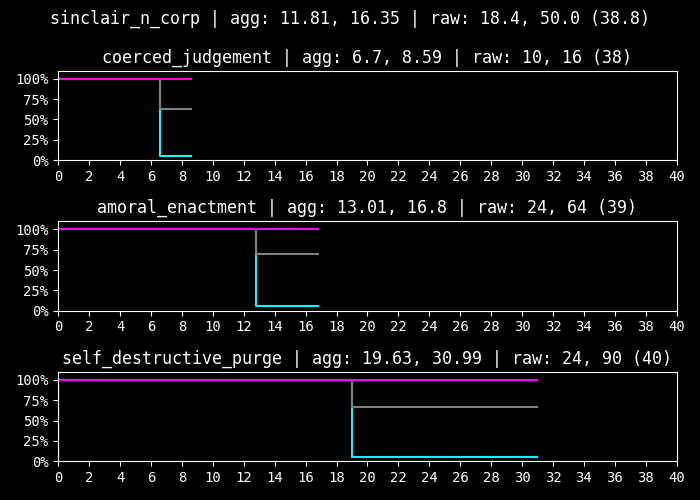
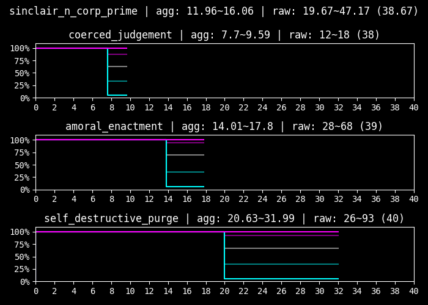

\+ Minus coins provide an unprecedently strong baseline clash power, since destroyed coins are unable to lower skill clash power  
\+ Unrolled damage coins are treated as tails rolls, giving skills a powerful first hit, which also opens up new ways to play around stagger thresholds  
\+ Corrosion tempo tech allows him to act during stagger or manifest EGO without paying resource costs  
\+ Strangely powerful defensive skill that does not interfere with sin generation and offers a means of controlling sanity when anticipating high drops  
\+ Control over sanity scales with the number of actions he receives, increasing his consistency when being the first action recipient, or in low-sinner compositions  
\+ Different corroded EGO skills may generate with different targets, making indiscriminate targeting more lenient  

\- Will effectively never maintain the consistency of plus coin units; kit maximization is impractical  
\- Works relatively poorly in a full team due to the higher chance of hitting allies and worse sanity control  
\- Skipping EGO in favour of panic invokes a heavy opportunity cost, and giving up on sanity management massively reduces his consistency  
\- Benefits more from being max level than usual  
\- Strangely low defense (but offset with a high health pool)  

`Skill 2 and 3 are simply fantastic, Great clasher.`

---

### S Tier: Don Quixote - W Corp. L3 Cleanup Agent

The weak chart represents Don Quixote with Rip Space uncharged.

\+ Rewards technical play more than any other identity  
\+ Playing around S3 tempo sets the standard for what high DPS should look like  
\+ Being a charge unit with an evade lends well to high performance solo or low-sinner clears, and causes her to benefit from being the first action recipient
\+ S2 inflicts fragile, rewarding tempo control even further  
\+ Manipulating skill order allows charging and firing S3 on the same turn, resulting in good fragile usage and less dead turns  
\+ Well-known synergy with Telepole and a lesser-known synergy with W Faust's support passive, but relies on neither  
\+ S2 and S3 are great at clashing, as befitting an S tier unit  

\- Miserable S1 and charge limitations can result in dead turns  
\- Performance degrades significantly or has increased reliance on Telepole when only given one action a turn  
\- Impractical for autobattle (worth mentioning, but does not factor into her ranking)  

*When the space is ripped (clear by Nex)*

---

### S Tier: Heathcliff - R Corp. 4th Pack Rabbit

The prime chart represents Heathcliff with +1 power from his charge passive and +1 power from Bodysack. The weak chart represents him with less than 6 speed.

\+ Quick Suppression at 6+ speed performs a similar role to Rip Space  
\+ Tech exists to conserve ammo, such as making him the last action recipient, or using Bodysack to cycle S1 and S2  
\+ Still clashes when out of ammo, neutralizing incoming threats with insane rolls  
\+ Kit effects also add considerably more damage than is standard, with 4 fragile on S3  

\- Despite having an evade, soloing is not advisable due to ammo  

---

### S Tier: Yi Sang - Effloresced E.G.O::Spicebush

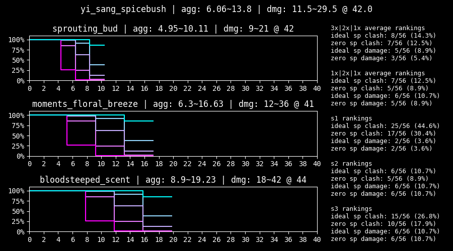

\+ Great clash and damage power from raw roll numbers alone  
\+ Multicoin AoE is insane but situational  

\- Punished harsher against enemies that burst tremor and apply potency (but this is inherently situational and chances are he'll perform well anyways)  
\- S3's deluge is impractical even with heavy sinking investment  

*Tutorial by LIF-tan*

---

### S Tier: Ryoshu - R.B. Chef de Cuisine

\+ Consistently strong fighter that can be expected to clash and deal damage reliably  
\+ S3 has reversed scaling with enemy defense  
\+ Evade recycles can stack 4th Match Flame, adding tempo to S3  
\+ Viable in low-sinner and solo compositions  
\+ No ammo or charge limitations  
\+ Obligatory mention of her mild team healing sustain  

\- Kit effects are disorganized and stage dependent (but her numbers don't rely on them)  
\- Extremely similar to N Faust, who trades numbers for debuffs

---

### S Tier: Faust - The One Who Grips

The prime chart represents Faust with Representation Emitter's +2 power active.

\+ S2 oriented with high damage from multicoins  
\+ No ammo or charge limitations  
\+ Fares consistently and reliably with her great numbers  
\+ Debuffs from kit effects provide easily capitalizable tempo  
\+ Sanity restoration is a nice quality of life boost but generally unimpactful   

\- Extremely similar to Chef Ryoshu, who trades debuffs for better numbers  

---

### S Tier: Rodion - Rosespanner Workshop Representative

Due to technical limitations, use the normal chart for evaluating aggregate and the prime chart for evaluating raw damage when S2 gains additional coins.

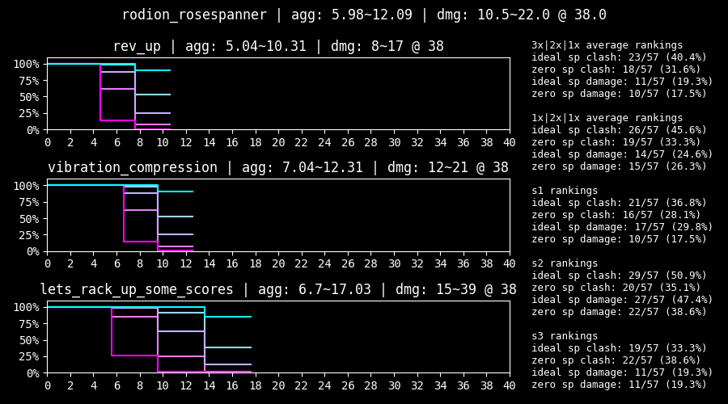
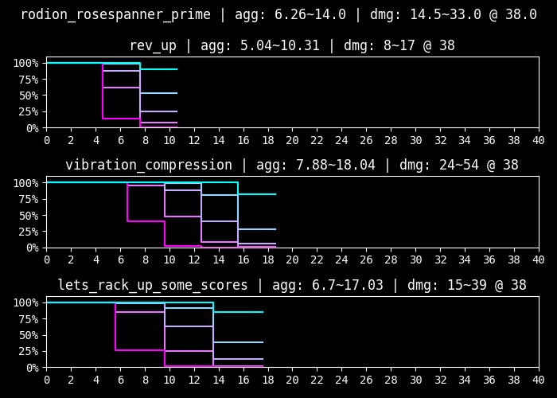

\+ Well-rounded damage spread across all three skills, with bias to S2  
\+ Consistently powerful damage rolls  
\+ Functions as a standalone tremor unit, opening up potential future synergies  

\- Relatively poor clashing power  
\- Tremor and stagger threshold manipulation are not that remarkable on their own  

---

### S Tier: Hong Lu - Tingtang Gangleader

Due to technical limitations, use the normal chart for evaluating aggregate and the prime chart for evaluating raw damage when S2 and S3 gain additional coins.

\+ Often tops the raw data clash aggregate rankings due to insane performance at max sanity  
\+ S3's unprecedented clash ceiling reduces dependence on enemy low rolls  
\+ S2's extra coin appears when attacking broken abnormality parts  
\+ Having an evade opens up low-sinner compositions  
\+ Has high defense for some reason  
\+ Kit contributes more damage than usual  
\+ No charge or ammo limitations  

\- Does not tolerate low sanity well (but is slightly offset by his passive)  
\- More of a clash tank than a pure damage conduit  

---

### A Tier: Gregor - G Corp. Manager Corporal

\+ Contrary to intuition, has virtually identical clashes to 7S Outis due to their difference in offense level  
\+ Kit provides so much healing that he will generally be able to shrug off lost clashes with little to no consequence  
\+ Surprisingly fast for a tank, giving him the ability to pull dangerous skills away from core units  
\+ Deliberately allowing him to stagger and healing him up during low pressure effectively removes his own stagger thresholds for later rounds  
\+ Piloting him feels like giving the team a regenerating frontal shield, enabling heavy damage payloads (e.g. Cloud Cutter) to land without risking a clash  
\+ Building around Legerdemain allows him to take on a damage role  

\- Does not have S tier roll numbers  
\- Happens to be the author's favourite unit (so take that bias as you will)  

---

### A Tier: Outis - Seven Association South Section 6 Director

Due to technical limitations, the normal chart should be used to evaluate clashes, and the weak chart should be used to evaluate damage.

\+ Can be thought of as a less durable but more explicitly supportive version of G Gregor  
\+ Kit has far more debuffs than usual  
\+ Paralysis on S1 and offense down on S3 make it easier for the team to win clashes  
\+ High speed allows her to pull clashes reliably  
\+ High defense and only one stagger threshold also allows her to tank the clashes she can't win  

\- Despite her public opinion of being a great clasher, the numerical truth is that her clash power is not that remarkable  
\- Damage attributed to her defense level down and weakness analyzed debuffs often does not compensate for her poor numbers  
\- Having lots of effective health is rarely preferable to G Gregor's regeneration, who competes for her role  

---

### A Tier: Hong Lu - Kurokumo Wakashu

Due to technical limitations, use the normal chart for evaluating aggregate and the prime chart for evaluating raw damage.

\+ Cloud cutter.

---

### A Tier: Ryoshu - Seven Association South Section 6

The prime chart represents Ryoshu with Upper Slash's effect and next turn +1 attack power active.

\+ Part of the low rarity clash god trio with L Faust and Shi Don, who all play similarly  
\+ Above average roll numbers make her solid to pilot  
\+ Kit provides an unprecedented amount of slash fragility, contributing a significant amount of damage  
\+ Clash win effects in her kit press her advantage of having excellent rolls  
\+ S3 contributes even more in low-sinner teams (but having a counter instead of an evade can reduce her effectiveness)  

\- Raw damage is more concentrated in S3 and lower overall compared to L Faust and Shi Don  

---

### A Tier: Faust - Lobotomy Corp. Remnant

The prime chart represents Faust with Representation Emitter's +2 power active, and the weak chart excludes Opportunistic Slash's +3 coin power.

\+ Part of the low rarity clash god trio with 7S Ryoshu and Shi Don, who all play similarly  
\+ High-end rolls translate to solid clashes and acceptable damage  
\+ Haste from S2 provides great pulling power, allowing her to put her insane clash power to use, making her an extremely competent fighter  

\- Remarkably poor stagger thresholds, making her feel somewhat glassy  

---

### A Tier: Ishmael - R Corp. 4th Pack Reindeer

The prime chart can be used to evaluate Ishmael's clashes while Snagharpoon is active. Note that the normal chart should still be used to evaluate damage.

\+ Plays similarly to W Don, but with worse numbers  
\+ Well-rounded kit with a strong S1  
\+ Suffers no consequences when firing uncharged S3 when solo, albeit without being able to clash or choose a target  
\+ Combat passive drains sanity for attack power, which can be easily offset through support passives or clash wins  

\- Held back by her somewhat miserable 32 offense  
\- Below average contributions from kit effects  
\- Charge limitations are exaggerated by poor generation from her kit  

---

### A Tier: Heathcliff - Lobotomy E.G.O::Sunshower

The prime chart represents Heathcliff with his S2 power and +1 power to all skills from Bodysack.

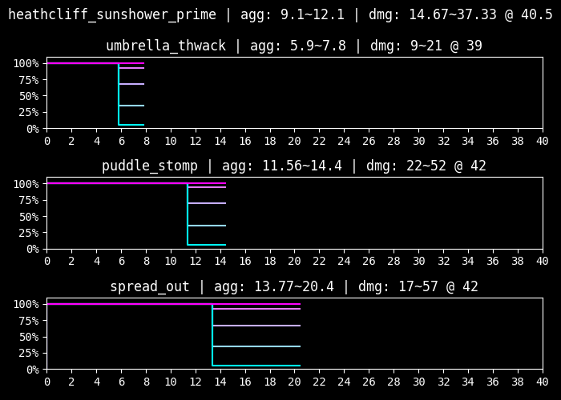

\+ Very high theoretical damage output  
\+ Kit effects are synergistic and contribute much more damage and survivability than is standard  
\+ Most viable Heathcliff identity to spam EGOs that consume sanity  
\+ Similar to G Gregor with Legerdemain, Suncliff has notable synergy with AEDD  
\+ Strong counter skill is inherent to his gameplay without sacrificing damage tempo  
\+ Like Ninclair, benefits greatly from being the first action recipient  

\- Clashes are surprisingly bad, even for a negative coin unit (but his counter and consuming sinking via getting hit somewhat offset this)  
\- Sinking micro does not so much reward forward thinking as punish a lack of it  
\- Sinking stacks are not preserved between fights, exacerbating his slow ramping time  
\- Somewhat reliant on being hit to accelerate sinking, which can lead to unintentional corrosions or staggers (but the latter is offset slightly from AEDD's passive or other sources of healing)  
\- Requires the team to be built around him and will not be able to function smoothly in random squads  
\- Benefits more from being max level than usual  
\- Seems to be tuned for the sanity changes that ended up being reverted  

---

### A Tier: Ishmael - Shi Section 5

The prime chart represents Ishmael with Flashing Strike's additional coins. Snagharpoon's passive is not included in the prime chart for ease of evaluating damage.

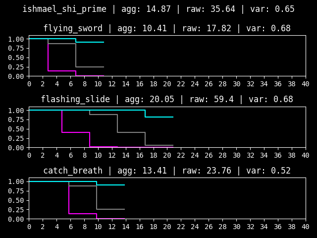

\+ Decent clash power while above her health threshold  
\+ Gains incredibly high numbers and performance in her prime state  
\+ Keeping her at UT2 to avoid diluting her skill pool is speculated to result in better performance  

\- Below average damage while above her health threshold  
\- Maintaining her prime state is impractical outside of Refraction Railway  
\- Needing to go through at least one stagger forces dead turns  
\- Unwanted healing priority can be awkward to manage  

---

### A Tier: Ryoshu - Kurokumo Wakashu

\+ Above average rolls  
\+ Inflicts bleed count, making the status effect more impactful  

\- Damage contributed by bleed is substandard compared to just using skills with bigger numbers  
\- Doubling down on more bleed invokes a greater opportunity cost (but this applies to status teams in general)  
\- Bleed relies on the target to attack, making it miserable when targeting a broken part or staggered enemy  
\- Has a minor amount of anti-synergy with KK Hong Lu, since Cloud Cutter checks bleed count  
\- Other parts of her kit apply on the same turn and are relatively unimpactful  

---

### A Tier: Don Quixote - Shi Section 5 Director

The prime chart represents Don with Overbreathe's effect active. The activation condition is extremely restrictive, so it is added for the sake of completeness, and does not factor into her ranking.

\+ Part of the low rarity clash god trio with L Faust and 7S Ryoshu, who all play similarly  
\+ Has the highest clash power of the trio at the cost of having the lowest damage  
\+ Gains haste from her S2 and passive, giving her the speed she needs to maximize her clashes  
\+ Only has two stagger thresholds, making her more forgiving than intuition would suggest  

\- Outstanding clash power often does not compensate for having poor damage  

---

### B Tier: Outis - LCB Sinner

\+ Great damage and decent clashes make for a surprisingly workable identity  
\+ Workable S1 gives her a rare tempo, and serves as a solid tool to clean up staggered targets or exploit skills that are easy to clash  
\+ Hit effects contribute a lot more damage than is standard  

\- Only 26 defense makes her glassy  
\- May be directly outperformed by higher tier damage-oriented identities  

---

### B Tier: Hong Lu - LCB Sinner

The weak chart represents Hong Lu without the additional coin power on S2 and S3.

\+ Decent damage and reliable clashes  
\+ S2 and S3 behave similarly and provide a powerful baseline performance  

\- Kit effects contribute less damage than is standard  
\- Attack power down on S3 also applies on the same turn, making it somewhat limited  

---

### B Tier: Rodion - Kurokumo Wakashu

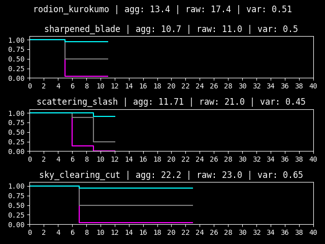

\+ Serviceable rolls and a mildly clunky kit make her playable but generally unremarkable  
\+ Notably high base power on her S2 and S3, lessening dependence on RNG in low sanity scenarios  

\- S3 effects are restrictive due to lacking count for both her bleed and poise, requiring additional effort to build around for maximization  
\- Passive theoretically has a powerful tempo, but finding situations that favour countering over clashing requires creativity  

---

### B Tier: Sinclair - Blade Lineage Salsu

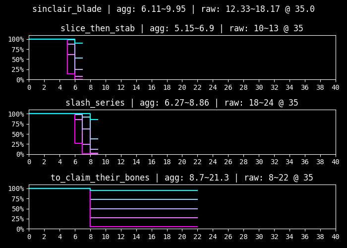

A bit about Blade Lineage identities:

While L Faust, 7S Ryoshu and Shi Don achieve excellence at their best, BL Yi Sang and BL Sinclair are capable of performing consistently in dicey situations. The distinction comes from how their skills are balanced— the former has high highs and low lows, and vice versa. Furthermore, most of the former have evades, and these two have counters, furthering this "constant output" philosophy. This causes the former trio to have amazing rolls once scaled to max sanity, while the latter will remain consistent but relatively unimpactful. This is represented by the former's high variance, and vice versa. If consistency is what one seeks, these two are likely to perform the same regardless of whether they're rolling heads or tails, giving them fairly good low sanity tolerance. 

However, in this snowball, high sanity meta where 95% heads is common, units that favour base power tend to underperform. Despite how consistently these skills can achieve their expected clash power, they probably will still rely on the opposing skill to low roll due to their low aggregate, ironically making them arguably less consistent than coin power oriented units. 

\+ S3 can function as a pseudo-ego  
\+ Kit effects are functional, providing the rare poise count on S1 and a solid passive  

\- Does not make use of max sanity remotely as well as units with coin power

---

### B Tier: Yi Sang - Blade Lineage Salsu

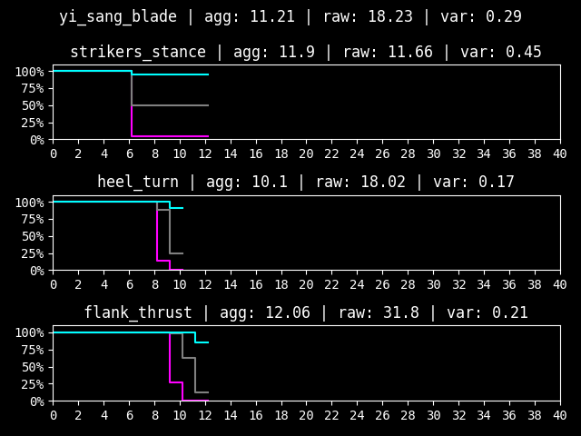

\+ Can be thought of as an exaggeration of BL Sinclair, with the lowest variance of all plus coin units but no clash aggregate to make use of it  
\+ S2 and S3 can be expected to perform the same regardless of sanity  
\+ Having poise count on both his S2 and passive makes him relatively okay at stacking it as well, giving him a decent amount of power from kit effects  
\+ Flank Thrust has decent raw damage, which can be attributed to being a multicoin with high offense level  

\- Horrendous lack of high rolls will make his clashes either extremely safe or reliant on the enemy to flip tails— most often the latter  
\- Analysis that applies to BL Sinclair can typically apply to BL Yi Sang, and vice versa  

---

### B Tier: Gregor - Rosespanner Workshop Fixer

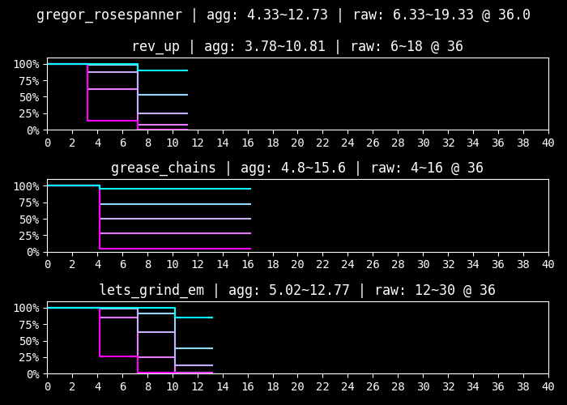

\+ Decent rolls  
\+ Below average contributions from kit effects  

\- Rolls are more sanity reliant than usual  
\- Mediocre and easily replacable  

---

### B Tier: Heathcliff - Shi Section 5

The prime chart represents Heathcliff under 25% HP and with Bodysack active.

\+ Despite his poor reputation, Shi Heathcliff's clashes are actually relatively pretty great  
\+ Might be viable if he's played like a normal fighter, and is given a source of healing to keep him topped off from the S3 self-damage  

\- But, after consulting someone who has an UT3 Shi Heathcliff, there are probably safer investments than this...  

---

### B Tier: Gregor - Liu Association South Section 6

The prime chart represents Gregor with +1 power from his S2 effects.

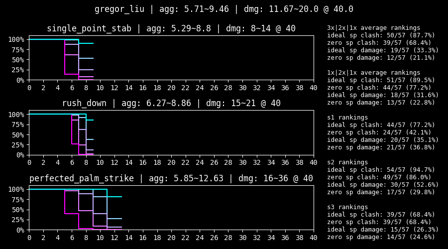
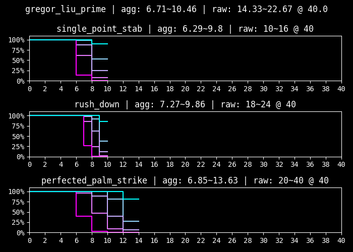

A bit about Liu Association identities:

The Liu Association can be summarized as favouring damage over clashes. Due to how their burn stacks play into each other, their kit effects will contribute more and more depending on how hard burn is being funneled. For maximization, utilizing all three is recommended, even if some of them are merely used to provide their support passive. Additionally, they will perform best when there is one centralized unit to stack burn upon.

\+ Contributes the most burn potency of the Liu trio  
\+ Functions the best as a standalone Liu unit, taking on the role of a high damage unit with S3 tempo  
\+ Highest speed out of the trio  

\- Outside of S3, plays somewhat similarly to Blade Lineage units, relying on low variance and high coin count to win clashes by waiting for enemies to low roll  
\- On the glassier side in terms of health and defense  

---

### B Tier: Hong Lu - Liu Section 5

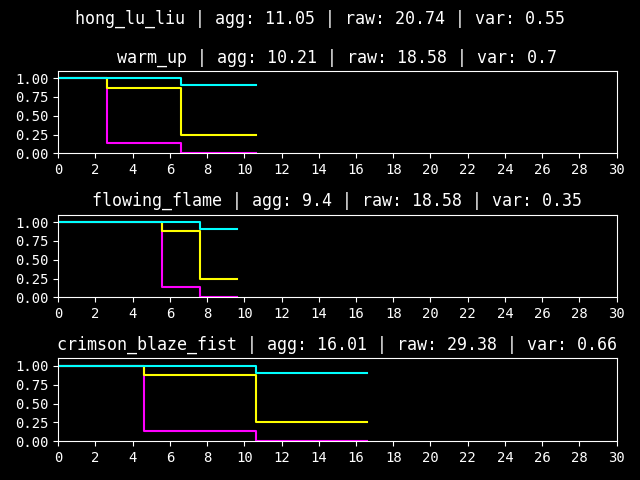

\+ Most clash-oriented of the Liu trio, while still playing into the philosophy of multicoin damage  
\+ Contributes the much needed burn count for burn funnel, but the least burn potency  
\+ Surprisingly tanky too— has higher defense and one less stagger threshold than Liu Meursault  

\- Slightly miserable offense level, making his damage deceptively lower than raws would suggest  

---

### B Tier: Meursault - Liu Association South Section 6

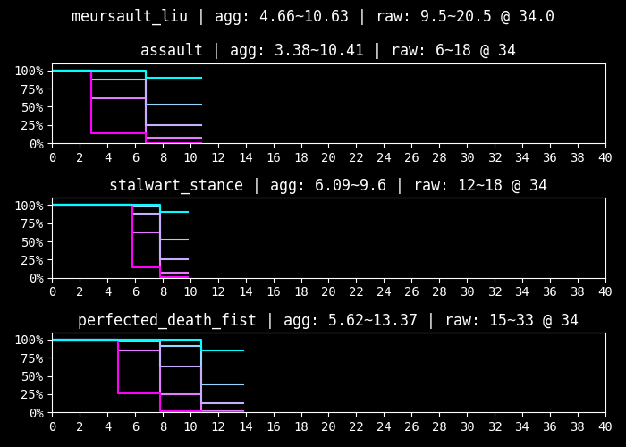

\+ Forms the middle ground of the three Liu identities  
\+ Contributes both potency and count, but cannot practically sustain the burn count on his own with only one or two actions  
\+ S2 and S3 effects are capable of choosing the same target multiple times, maintaining his kit effect contributions in encounters with fewer enemies  

\- Being mediocre at everything makes for a rather mediocre unit  
\- Arguably the easiest one to bench  

---

### B Tier: Ishmael - LCCB Assistant Manager

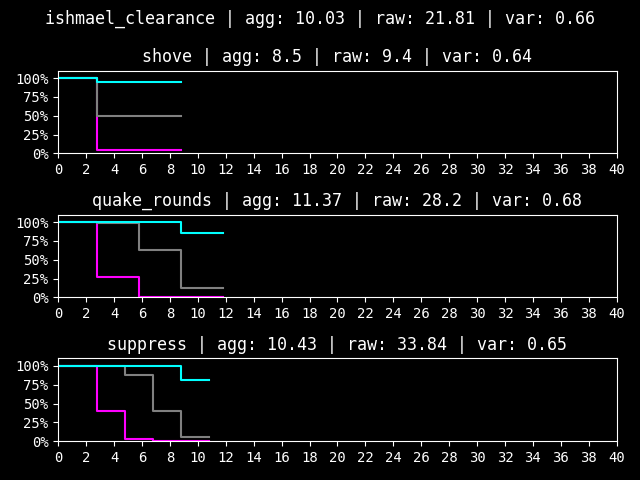

\+ Contributions come almost entirely from powerful debuffs on S3  
\+ Opens up extreme low-turn strategies in reset heavy contexts  
\+ Applying a myriad of statuses makes her likely to find synergies  
\+ Plays like a discount R Heathcliff with less ammo consumption  

\- Paralysis and attack down on S1 and S2 are applied on the same turn, limiting their effectiveness  
\- Terrible roll numbers and ammo limitations make her generally impractical  
\- Used almost exclusively to reset until she can fire S3 turn one in battles that take less than a couple turns  

---

### Unavailable Writeups

Writeups will not be available for the rest of the units, since they are generally unremarkable and do not have much nuance outside of what the average player can figure out by reading their pages and looking at their roll numbers. [Of course, their roll charts and numerical rankings will still be available here.](https://github.com/null-machine/limbus-company-clash-tool)

---

## Additional Notes

KK Hong Lu used to be placed in S tier, which was heavily contested by Nex and heavily defended by the other two. However, the addition of Rose Rodion (and even N Sinclair) edged heavily into his niche of having a nova S2. This creep, combined with his glaring lack of clash power, edged him into A tier. That being said, his turn one damage potential remains relatively uncontested, so his placement is something individual players are encouraged to decide for themselves.

LCB Outis and LCB Hong Lu used to be firmly placed in A tier by LOWERCASE, but that was contested by Kervina and Nex. Both have been dropped to B tier to make A tier more exclusive.

Shi Ishmael used to be in high B tier but was moved to low A tier after discussion in the Project Moon community server. The fact that she shares the same raw as Shi Don without needing her health threshold, alongside her prime performance, was enough to barely edge her in. That being said, individual players are encouraged to evaluate whether sacrificing the stability that high clash power and speed brings makes her worth prioritizing her over the other A tier units.

Whether G Gregor and Chef Ryoshu should receive a yellow badge was discussed. A slight preference was given to G Gregor, but it was decided that neither of them should receive one for fairness. Their healing is unlikely to make or break a clear, but both are definitely situationally impactful.

One thing to keep in mind is that stronger units do not necessarily correlate with more enjoyment. Weaker sinners tend to compensate their lack of power in their own strange ways, and giving them a chance tends to lead to making some funny memories. Additionally, the game in its current state is easy enough to comfortably clear with just a support unit, so there's no need to worry about accessibility yet.